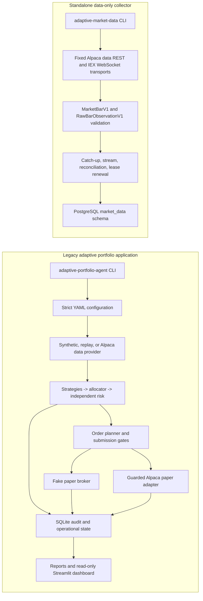

# Architecture

## Purpose and status language

This repository currently contains two executable systems under the
`adaptive_trader` package: a legacy portfolio-research and paper-simulation prototype,
and a standalone market-data collector. The generic signed platform described in
`docs/requirements.md` is the target architecture; it is not silently substituted for
either current system.

| Area | Status | Evidence boundary |
| --- | --- | --- |
| Legacy synthetic backtest and deterministic replay | `IMPLEMENTED_AND_VERIFIED` | Offline CLI regressions and pytest coverage |
| Legacy observer and guarded Alpaca paper adapter | `IMPLEMENTED_NOT_EXTERNALLY_VALIDATED` | Code and safety tests exist; tracked submission is disabled and no credential-based run is recorded |
| Data-only collector contracts, orchestration, and PostgreSQL schema | `IMPLEMENTED_AND_VERIFIED` | Fake-source tests, PostgreSQL integration tests, and migration checks |
| Collector operation against Alpaca and a hosted database | `IMPLEMENTED_NOT_EXTERNALLY_VALIDATED` | Transport exists; no credential-based or hosted-runtime evidence is recorded |
| Generic signed platform path | `PARTIALLY_IMPLEMENTED` | Canonical/hash, universe/experiment/profile, static CLI, owner-private secret-file, and service-scoped runtime-setting primitives plus tests |
| New model training and replacement backtester | `INTENTIONALLY_DEFERRED` | Excluded from the current platform-backbone work |

## Current system context



The systems do not currently share a read model. The legacy application does not consume
the collector's PostgreSQL tables, and the collector does not invoke legacy strategies,
risk, or execution. This separation is intentional until versioned generic platform
contracts replace implicit coupling.

External actors are the local operator, Alpaca Market Data, an optional Alpaca paper
account, PostgreSQL, and the local filesystem. Ordinary tests replace all external Alpaca
access with fakes and guard the common Python TCP connection paths used by current adapters.

## Current components

### Legacy application

| Module or entry point | Responsibility and owned state | Public interface | Allowed dependencies | Forbidden direction / failure behavior |
| --- | --- | --- | --- | --- |
| `adaptive_trader.cli` | Dispatches commands; owns parsed arguments and temporary adapter lifetimes, not durable state | `main()` and `adaptive-portfolio-agent` | Configuration, orchestrators, repositories, and reports constructed lazily | Import alone must not construct network clients; command failure exits nonzero and failed gates stop mutation |
| `config.py` and `configs/*.yaml` | Validates configuration and derives its canonical hash; owns parsed in-memory settings | `AppConfig`, section models, and `load_config()` | Dataclasses and YAML | Credentials and real-money configuration are rejected; unknown/invalid fields fail startup |
| `data.py`, `market_data_live.py` | Validates daily research data and implements legacy historical/stream providers; provider/`BarStore` instances own connection, buffer, and freshness state | `MarketData`, load/validate/generate functions including compatibility-only `download_market_data()`, `MarketDataProvider`, concrete providers, and `BarStore` | Synthetic/replay data, optional `legacy-yahoo`, Alpaca SDK at explicit runtime boundaries, clock, logging, and persistence | Future/inconsistent bars fail validation; connection errors stay typed/redacted; these modules do not plan or submit orders |
| `strategies/`, `regimes.py`, `allocator.py` | Produces legacy long-only proposals and allocations; owns configuration/in-memory calculation state only | Strategy classes plus regime and allocation functions consumed by orchestration | Features, immutable market inputs, and configuration | No persistence, broker mutation, execution authority, or risk-policy ownership; invalid numerical inputs reject or yield documented safe outputs |
| `decision_engine.py` | Builds a completed-history forward target; owns its injected config/provider, calculation components, mutable operational context, and latest immutable diagnostic metadata | `ForwardDecisionEngine`, `ForwardDecisionMetadata`, and `ForwardDecisionError` | Data-provider protocol, features, strategies, regime, allocator, and risk | No broker, order manager, or repository dependency; future bars are excluded and incomplete/nonfinite inputs fail without producing a target |
| `backtest.py` | Runs six causal historical portfolios and owns in-memory simulation/results until artifacts are written | `BacktestSuiteResult`, `run_backtest_suite()`, and `run_pipeline_from_config()` | Configuration, normalized data, strategies, regime, allocator, risk, NumPy, and pandas | No broker side effect or live state; invalid chronology/assumptions raise `BacktestError` and partial results are not presented as complete |
| `risk.py` | Independently evaluates legacy exposure, freshness, loss, and drawdown; owns configuration and per-call calculation state only | `RiskContext`, `RiskEngine`, and `apply_risk_controls()` | Proposed weights, market/account facts, configuration, NumPy, and pandas | No broker or persistence mutation; missing, stale, or nonfinite safety input blocks or reduces exposure |
| `execution.py`, `broker.py`, `reconciliation.py` | Plans and persists orders, talks to a selected broker, consumes updates, and reconciles; manager/fake-broker instances own bounded runtime state while SQLite owns durable facts | `OrderStateMachine`, `OrderPlanner`, `OrderManager`, `Broker`, fake/paper implementations, and `Reconciler` | Clock, configuration, logging/redaction, `AuditRepository`, and fake or fixed paper-only Alpaca clients | No real-money client; invalid transitions reject, and ambiguous submission is persisted and reconciled rather than blindly retried |
| `persistence.py` | Owns legacy SQLite schema, immutable receipts, events, projections, incidents, and latches | `Database`, `AuditRepository`, readiness and canonical-hash helpers | SQLAlchemy, SQLite, and canonical serialization helpers | Transaction failure rolls back; immutable facts are not rewritten with later outcomes |
| `live.py` | Coordinates once-per-session work, monitors, shutdown, and recovery; owns worker threads, stop state, and current-cycle context | `LiveService`, `LiveCycleResult`, and `one_shot()` | Explicit clock, data provider, decision target, broker, execution, reconciliation, and repository boundaries | Blocking incidents, stale/ambiguous state, or worker failure prevent exposure and propagate a bounded failure |
| `replay.py` | Replays supplied event order through the live path; owns a fake clock/broker and, by default, an isolated in-memory database for a run | `ReplayResult`, `generate_synthetic_replay_events()`, `load_replay_events()`, and `run_replay()` | Fake broker/clock, replay provider, decision engine, live orchestration, and persistence | No external provider/broker; malformed or duplicate-sequence evidence fails, out-of-order timestamps cannot move the clock backward, and deterministic logical state is required |
| `reporting.py`, `forward_reporting.py`, `app.py` | Derives evidence and renders read-only views; owns transient frames/UI state and generated report files | Report-generation functions and the Streamlit process entry point | SQLite, bounded artifact paths, pandas, and Streamlit | No broker mutation; missing/corrupt state produces a bounded report/UI error rather than changing authority state |

The detailed legacy schema and behavior remain documented in
`docs/architecture.md` and `docs/data_dictionary.md`.

### Standalone collector

| Module | Responsibility and owned state | Public interface | Allowed dependencies | Forbidden direction / failure behavior |
| --- | --- | --- | --- | --- |
| `collection.universe` | Defines the immutable in-process 29-symbol collection contract; owns no runtime state | `CollectionRole`, `UniverseMemberV1`, `CollectionUniverseV1`, and `COLLECTION_UNIVERSE_V1` | Standard library | Every member has `execution_authorized=false`; WDC cannot substitute for SNDK |
| `collection.contracts` | Validates canonical OHLCV, identity/content hashes, and raw provenance; value objects own immutable event data | `MarketBarV1` and `RawBarObservationV1` | Frozen dataclasses, `Decimal`, and UTC | Invalid, nonfinite, future-inconsistent, or malformed values are rejected before persistence |
| `collection.alpaca` | Implements fixed historical REST and IEX WebSocket data transports; instances own bounded HTTP/stream lifecycle state | `AlpacaHistoricalBarSource`, `AlpacaLiveBarSource`, and `AlpacaDataSourceError` | `requests`, `websockets`, canonical contracts, and collection-universe checks | No trading SDK, broker endpoint override, paper credential access, or persistence mutation; malformed/protocol failures are typed |
| `collection.service` | Coordinates XNYS catch-up, live ingestion, overlap reconciliation, retries, and worker shutdown; owns lease/run references, counters, stop/fatal state, and worker threads | Source protocols, `CollectorServiceConfig`, `CollectorService`, and `completed_bar_cutoff()` | Source/repository protocols, canonical contracts, immutable universe, `exchange_calendars`, and bounded threading/timing primitives | No trading or DDL dependency; deterministic/protocol failures stop, retry and shutdown waits are bounded, and stale fencing rejects writes |
| `collection.postgres` | Owns collector PostgreSQL rows and implements transactional observation/projection batches, separate or combined checkpoint updates, runs, events, and lease fencing | `PostgresMarketDataRepository`, `normalize_postgres_url()`, and `postgres_connect_args()` | SQLAlchemy, psycopg, schema metadata, repository contracts, canonical observations, and immutable universe | Ingestion/run/event/bar/checkpoint mutations after acquisition are fenced; idempotent universe registration and lease lifecycle are explicit exceptions; SQL is parameterized and failures roll back the current transaction |
| `collection.schema`, `migrations/` | Defines Alembic-owned `market_data` tables, constraints, indexes, and selected immutable-row triggers; PostgreSQL owns durable schema state | SQLAlchemy metadata/revision contract and `alembic upgrade head` | PostgreSQL and Alembic | Runtime startup refuses schema or required-trigger drift; runtime code does not create schema |
| `collection.cli` | Dispatches collector commands; owns parsed settings and adapter lifetimes, not durable state | `main()`, `adaptive-market-data`, and `migrate`/`status`/`ready`/`backfill`/`run` commands | Collector configuration, sources, service, repository, and migrations | Only `backfill` and `run` load data credentials; import/status/readiness avoid provider construction and errors omit secret values |

The collector owns eight PostgreSQL tables: `collection_universes`,
`bar_observations`, `current_bars`, `collector_checkpoints`, `collector_leases`,
`ingestion_runs`, `collector_events`, and `data_gaps`. Explicit gap production is
`NOT_IMPLEMENTED`; the existing table reserves the lifecycle while checkpoints and overlap
reconciliation are the active recovery mechanism.

### Generic platform foundation

| Module | Responsibility and owned state | Public interface | Allowed dependencies | Forbidden direction / failure behavior |
| --- | --- | --- | --- | --- |
| `platform.canonical` | Converts a closed and explicitly bounded set of scalar/container values into deterministic UTF-8 JSON bytes; owns no mutable state | `CanonicalizationError` and `canonical_json_bytes()` | Standard-library JSON, UTC datetime, Decimal, and Enum types | No provider, persistence, environment, filesystem, or secret dependency; unsupported, nonfinite, naive-time, unordered, cyclic, subclassed-wrapper, oversized, or invalid-UTF-8 input fails with structural context and without rendering values |
| `platform.hashing` | Derives content hashes from canonical bytes; owns no mutable state | `sha256_hex()` | `platform.canonical` and standard-library SHA-256 | No alternate serializer or implicit coercion; canonicalization failure prevents a hash result |
| `platform.universe` | Owns immutable generic symbol roles and derives deterministic collection/order allowlists | `SymbolRole` and `UniverseSpec` | Pydantic and standard-library validation | No flagship literals, provider, persistence, environment, broker, or alias authority; invalid, duplicate, overlapping, or empty active membership fails closed |
| `platform.config` | Loads bounded no-symlink experiment/profile YAML, verifies the mandatory profile pin, enforces mode authority, and composes immutable service-scoped startup settings from an explicitly injected environment mapping | `ExperimentDefinition`, `PlatformProfile`, `ExperimentSpec`, `PlatformConfig`, `RuntimeService`, `RuntimeSettings`, and loaders | Canonical/hash/universe/security primitives, Pydantic, PyYAML, URL parsing, and POSIX file operations | No ambient environment, secret-value, client, database, plugin, or network authority; malformed paths/YAML/types/hashes/mode/service combinations fail with safe context-free errors |
| `platform.cli` | Exposes broker-free static `doctor` and `config validate` commands through the new aliases; owns no state | Typer `app` and `main()` | `platform.config`, JSON, paths, and Typer | No environment, secret, provider, broker, persistence, dynamic-import, network, or write authority; invalid configuration exits nonzero without constructing a client |
| `platform.security` | Validates opaque secret-file references and loads one explicitly sourced secret into an immutable redacted value only at an authorized adapter boundary | `SecretFileVariable`, `SecretFileReference`, `SecretFileError`, `RedactedSecret`, and `load_secret_file()` | POSIX descriptor-relative file APIs, paths/stat, and Pydantic serialization hooks | No environment lookup, persistence, provider/broker/client, dynamic import, or network authority; unsafe type/path/owner/mode/size/content fails without exposing the path, value, or operating-system exception |

## Current data flows

### Collector

1. The CLI verifies the Alembic head and registers the content-addressed collection-universe row.
2. A singleton lease is acquired; fencing tokens authorize each state mutation.
3. Historical requests are clipped to XNYS regular-session windows.
4. REST and WebSocket payloads pass through the same canonical contracts.
5. `bar_observations` retains each stable observation; `current_bars` selects one
   deterministic projection and increments revisions for effective content changes.
6. After every observation batch is durable, a separate fenced transaction advances the queried
   interval checkpoint. A crash between these steps leaves the checkpoint behind; overlap replay
   is idempotent and does not skip the already-stored bars.
7. The live path reconciles an overlapping completed interval every minute.
8. Shutdown stops admission, joins workers within a shared bound, finalizes the run, and
   releases the lease without hiding the primary failure.

### Legacy decision path

1. A strict configuration selects synthetic, replay, or explicit external inputs.
2. Completed prior-session history is sliced before strategy evaluation.
3. Momentum and mean-reversion propose long-only weights; the allocator adds cash.
4. The independent risk engine reduces or rejects the proposal.
5. The planner creates deterministic, sell-before-buy intents.
6. Observer/dry-run records evidence. Submission requires every paper-only gate.
7. Durable intent precedes a broker side effect; events and fills are reconciled afterward.

## Persistence and state ownership

- SQLite is the legacy authority for decisions, orders, fills, incidents, latches,
  heartbeats, and forward-paper evidence. It is also used for replay and tests.
- PostgreSQL is the collector authority. Alembic, not runtime `create_all`, owns its schema.
- `bar_observations` and legacy decision/event records preserve append-only evidence.
- `current_bars`, checkpoints, order status, and heartbeats are bounded projections derived
  from durable facts.
- Runtime databases, logs, downloaded data, and outputs are ignored local artifacts.
- Parquet dataset lineage and object-store persistence are `NOT_IMPLEMENTED`.

## External interfaces and credentials

- `adaptive-portfolio-agent` is the legacy console entry point.
- `adaptive-market-data` and `python -m adaptive_trader.collection` are collector entry points.
- `app.py` starts the current Streamlit dashboard; it reads legacy SQLite directly.
- The optional `legacy-yahoo` extra supports the public compatibility-only
  `download_market_data()` adapter; canonical Alpaca configurations never fall back to it.
- The collector accepts only `APA_ALPACA_DATA_API_KEY`,
  `APA_ALPACA_DATA_SECRET_KEY`, and collector-specific database settings.
- Legacy paper execution uses separate `APA_ALPACA_PAPER_*` variables and remains disabled
  in tracked YAML and `.env.example`.
- The collector requires TLS hostname verification for non-loopback PostgreSQL and rejects
  query-string connection-routing overrides.
- A private control API, operator-token authentication, and API-backed dashboard are
  `NOT_IMPLEMENTED`.

## Error, concurrency, and recovery model

Collector REST, stream, database, and worker waits are bounded. Retryable provider failures
use capped backoff; invalid protocol or bar content fails closed. Each PostgreSQL observation
batch atomically updates its current-bar projection. Historical collection advances coverage in a
separate transaction after all batches for that request are durable. A crash can therefore cause
safe duplicate replay, not an optimistic checkpoint. A singleton lease plus fencing token prevents
a stale process from continuing to write after takeover.

The legacy live service coordinates scheduled work and monitor loops around injected clock,
broker, data, and repository boundaries. Durable decision identity prevents a restart from
repeating a scheduled decision. Unknown broker submission state requires reconciliation
before exposure can increase.

## Security boundaries

- Collection authority is not execution authority.
- A strategy proposal is not order authorization.
- The standalone collector's data credentials use a namespace/container separate from the legacy
  paper adapter. The legacy Alpaca market-data provider still shares the legacy paper credential
  object and environment namespace. Target `RuntimeSettings` now rejects generic credential names
  and composes exact service-scoped opaque file references, but startup commands, container mounts,
  and service consumers do not yet enforce that target boundary.
- The collector image omits the external Alpaca package and legacy execution modules.
- The current dashboard is read-only but still has direct access to legacy SQLite; moving
  reads behind a private API is target work.
- CI and tracked example values provide no Alpaca credentials. Current Compose can explicitly
  inherit operator-supplied legacy credentials, while its tracked empty values keep submission
  disabled; the target credential-free offline Compose default is still unimplemented. The test
  fixture blocks the common Python TCP connection paths used by current adapters; process-wide
  socket denial remains target work.
- Real-money clients and endpoints are unsupported and prohibited.

See `docs/security-model.md` for threats, controls, and residual risk.

## Observability and deployment topology

The legacy runtime emits redacted console logs and rotating JSON logs, and persists
heartbeats, incidents, stream events, and reconciliation facts in SQLite. The collector
emits bounded console diagnostics and persists ingestion runs, events, checkpoints, and
lease state in PostgreSQL. `status` and `ready` expose collector read models; `ready` proves
only active lease/run ownership, not data freshness.

Current Compose services are `market-data-collector` behind profile `market-data`,
`trader`, `dashboard`, and `paper-trader` behind profile `paper`. The collector requires an
external PostgreSQL database. Multi-service platform workers, internal network segmentation,
Prometheus telemetry, and an API control plane are `NOT_IMPLEMENTED`.

## Performance-sensitive paths

- Batched bar normalization and PostgreSQL inserts/projection upserts.
- Historical REST pagination across 29 symbols and XNYS session windows.
- Legacy rolling statistics, covariance, backtest iteration, and report generation.
- SQLite event/reconciliation writes during live orchestration.

The collector batch size is bounded and query indexes support identity, recent-bar, lease,
and readiness lookups. A repeatable platform benchmark harness is `NOT_IMPLEMENTED`; no
latency or throughput guarantee is claimed.

## Target platform boundary

The selected target keeps legacy behavior intact while introducing a generic package path
for immutable experiment configuration, canonical serialization, data, scheduling, signal
envelopes, signed risk, intent-first execution, jobs/outbox, private API, observability, and
artifact lineage. The dependency direction is:

```text
external data -> canonical events -> durable readiness -> decision slot
-> untrusted signal envelope -> independent risk decision -> persisted order intent
-> selected fake/paper adapter -> broker events/fills -> reconciliation/audit
```

Only configuration may name the shipped experiment's symbols. Generic domain algorithms
must not hard-code them. Strategy extensions may return declarative envelopes but may not
receive credentials, broker objects, DDL authority, or dynamic code-loading input. The
execution worker is the only target process allowed paper credentials; tracked submission
remains disabled and authorization defaults deny.

Canonical serialization, hashing, universe/configuration, broker-free profile validation,
service-scoped runtime settings, opaque secret-file references, and the owner-private secret-file
primitive are implemented target-package boundaries. No service command consumes the runtime
settings or secret loader yet. Bootstrap, the remaining platform tree, services, tables, signed
contracts, scheduler, jobs, API, artifact store, and deterministic vertical slice are
`NOT_IMPLEMENTED`. Their ordered work and acceptance evidence live in
`docs/execution-plans/platform-core.md`.

## Critical invariants

1. No supported path can create a real-money order.
2. No ordinary test, CI job, or offline regression contacts Alpaca.
3. Collection membership grants no research or execution authority.
4. A bar identity includes provider, feed, adjustment, symbol, timeframe, and UTC start.
5. Observation/projection batches and later checkpoint advancement are ordered, transactional,
   lease-fenced, and idempotently replayable; the two steps are not one transaction.
6. A decision cannot use data that became available after its recorded cutoff.
7. Strategy output cannot bypass independent risk and execution authorization.
8. Intent is durable before broker submission, and ambiguous submission is never retried
   without reconciliation.
9. Credentials, database URLs, and authorization headers do not enter logs or evidence.
10. Documentation status never substitutes for executable behavior and recorded verification.

## Known limitations

- No credential-based collector or hosted PostgreSQL run has been recorded.
- Collector explicit gap lifecycle, security metadata, Parquet freezing, retention, and
  downstream data-consumer contracts are `NOT_IMPLEMENTED`.
- The legacy system is long-only and once-per-session; it is not the target signed intraday
  platform.
- The current dashboard reads SQLite directly and no private HTTP control plane exists.
- Current collector credentials are application-isolated but not provider-scoped as
  market-data-only credentials.
- Stored collection-universe membership is not reverified at startup and has no immutability
  trigger; a database owner can alter it without runtime detection.
- Compose does not provision PostgreSQL or enforce a general outbound firewall.
- Platform runtime settings and per-service secret-reference selection are implemented as pure
  startup composition, but local secret bootstrap, service command integration, and least-privilege
  mounts are not; the low-level loader currently has no service consumer.
- The generic platform remains `PARTIALLY_IMPLEMENTED`, and its paper authorization path is
  `NOT_IMPLEMENTED`; the current legacy paper adapter must not be presented as target-platform
  validation.

## Related decisions and details

- Design-decision index: `docs/adr/README.md`
- Active plan: `docs/execution-plans/platform-core.md`
- Collector operations: `docs/market_data_runbook.md`
- Legacy architecture: `docs/architecture.md`
- Legacy schema: `docs/data_dictionary.md`
