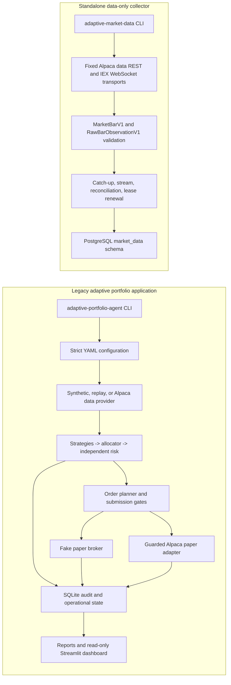

# Architecture

## Purpose and status language

This repository currently contains two executable systems under the
`adaptive_trader` package: a legacy portfolio-research and paper-simulation prototype,
and a standalone market-data collector. The generic signed platform described in
`docs/requirements.md` is the target architecture; it is not silently substituted for
either current system.

| Area | Status | Evidence boundary |
| --- | --- | --- |
| Legacy synthetic backtest and deterministic replay | `IMPLEMENTED_AND_VERIFIED` | Offline CLI regressions and pytest coverage |
| Legacy observer and guarded Alpaca paper adapter | `IMPLEMENTED_NOT_EXTERNALLY_VALIDATED` | Code and safety tests exist; tracked submission is disabled and no credential-based run is recorded |
| Data-only collector contracts, orchestration, and PostgreSQL schema | `IMPLEMENTED_AND_VERIFIED` | Fake-source tests, PostgreSQL integration tests, and migration checks |
| Collector operation against Alpaca and a hosted database | `IMPLEMENTED_NOT_EXTERNALLY_VALIDATED` | Transport exists; no credential-based or hosted-runtime evidence is recorded |
| Generic signed platform path | `NOT_IMPLEMENTED` | Requirements and execution plan only |
| New model training and replacement backtester | `INTENTIONALLY_DEFERRED` | Excluded from the current platform-backbone work |

## Current system context



The systems do not currently share a read model. The legacy application does not consume
the collector's PostgreSQL tables, and the collector does not invoke legacy strategies,
risk, or execution. This separation is intentional until versioned generic platform
contracts replace implicit coupling.

External actors are the local operator, Alpaca Market Data, an optional Alpaca paper
account, PostgreSQL, and the local filesystem. Ordinary tests replace all external Alpaca
access with fakes and guard the common Python TCP connection paths used by current adapters.

## Current components

### Legacy application

| Module or entry point | Responsibility and owned state | Public interface | Allowed dependencies | Forbidden direction / failure behavior |
| --- | --- | --- | --- | --- |
| `adaptive_trader.cli` | Commands for backtest, replay, observer, paper checks, status, reconciliation, halt/resume, and reports | `main()` and `adaptive-portfolio-agent` | Configuration and lazily constructed adapters | Import alone must not construct network clients; failed gates stop mutation |
| `config.py` and `configs/*.yaml` | Strict non-secret configuration and hashes | `AppConfig`, section models, and `load_config()` | Pydantic and YAML | Credentials and real-money configuration are rejected |
| `data.py`, `market_data_live.py` | Daily research data and legacy minute-stream providers | `MarketData`, load/validate/generate functions including compatibility-only `download_market_data()`, `MarketDataProvider`, and concrete providers | Synthetic/replay sources; Alpaca at explicit runtime boundaries; optional `legacy-yahoo` adapter | Future data cannot enter an earlier decision |
| `strategies/`, `regimes.py`, `allocator.py` | Legacy long-only proposals and allocation | Strategy classes plus regime and allocation functions consumed by orchestration | Feature and immutable input data | No broker mutation or risk-policy ownership |
| `risk.py` | Independent legacy exposure, freshness, loss, and drawdown controls | `RiskContext`, `RiskEngine`, and `apply_risk_controls()` | Proposed weights and operational context | Missing or nonfinite safety inputs block exposure |
| `execution.py`, `broker.py`, `reconciliation.py` | Plan, persist, submit when gated, consume updates, reconcile | `OrderStateMachine`, `OrderPlanner`, `OrderManager`, `Broker`, fake/paper implementations, and `Reconciler` | Fake broker or literal-paper Alpaca clients | No real-money client; ambiguous submission is not blindly retried |
| `persistence.py` | SQLite schema, immutable receipts, events, projections, incidents, and latches | `Database`, `AuditRepository`, readiness and canonical-hash helpers | SQLAlchemy | Receipts are not rewritten with later outcomes |
| `live.py` | Once-per-session orchestration, monitors, shutdown, and recovery | `LiveService`, `LiveCycleResult`, and `one_shot()` | Explicit clock, data, broker, repository boundaries | Blocking incidents and stale state dominate strategy output |
| `reporting.py`, `forward_reporting.py`, `app.py` | Derived evidence and read-only presentation | Report-generation functions and the Streamlit process entry point | SQLite and generated artifacts | No broker mutation from presentation code |

The detailed legacy schema and behavior remain documented in
`docs/architecture.md` and `docs/data_dictionary.md`.

### Standalone collector

| Module | Responsibility and owned state | Public interface | Allowed dependencies | Forbidden direction / failure behavior |
| --- | --- | --- | --- | --- |
| `collection.universe` | Immutable 29-symbol, content-addressed collection contract | `CollectionRole`, `UniverseMemberV1`, `CollectionUniverseV1`, and `COLLECTION_UNIVERSE_V1` | Standard library | Every member has `execution_authorized=false`; WDC cannot substitute for SNDK |
| `collection.contracts` | Canonical OHLCV validation, identity/content hashes, raw provenance | `MarketBarV1` and `RawBarObservationV1` | Frozen dataclasses, `Decimal`, UTC | Invalid, nonfinite, future-inconsistent, or malformed values are rejected |
| `collection.alpaca` | Fixed historical REST and IEX WebSocket data transports | `AlpacaHistoricalBarSource`, `AlpacaLiveBarSource`, and `AlpacaDataSourceError` | `requests`, `websockets` | No trading SDK, broker endpoint override, or paper credential access |
| `collection.service` | XNYS session catch-up, live ingestion, overlap reconciliation, retries, and worker shutdown | Source protocols, `CollectorServiceConfig`, `CollectorService`, and `completed_bar_cutoff()` | Provider and repository protocols | Deterministic/protocol failures stop; retry and shutdown waits are bounded |
| `collection.postgres` | Atomic observation/projection/checkpoint writes and lease fencing | `PostgresMarketDataRepository`, `normalize_postgres_url()`, and `postgres_connect_args()` | SQLAlchemy and psycopg | Ingestion/run/event/bar/checkpoint mutations after acquisition are fenced; idempotent universe registration and lease lifecycle are explicit exceptions; SQL is parameterized |
| `collection.schema`, `migrations/` | Alembic-owned `market_data` schema and immutable-row triggers | SQLAlchemy metadata/revision contract and `alembic upgrade head` | PostgreSQL | Runtime startup refuses schema or trigger drift |
| `collection.cli` | Collector command dispatch and safe output | `main()`, `adaptive-market-data`, and `migrate`/`status`/`ready`/`backfill`/`run` commands | Collector modules only | Only `backfill` and `run` load data credentials; errors omit secret values |

The collector owns eight PostgreSQL tables: `collection_universes`,
`bar_observations`, `current_bars`, `collector_checkpoints`, `collector_leases`,
`ingestion_runs`, `collector_events`, and `data_gaps`. Explicit gap production is
`NOT_IMPLEMENTED`; the existing table reserves the lifecycle while checkpoints and overlap
reconciliation are the active recovery mechanism.

## Current data flows

### Collector

1. The CLI verifies the Alembic head and immutable collection-universe hash.
2. A singleton lease is acquired; fencing tokens authorize each state mutation.
3. Historical requests are clipped to XNYS regular-session windows.
4. REST and WebSocket payloads pass through the same canonical contracts.
5. `bar_observations` retains each stable observation; `current_bars` selects one
   deterministic projection and increments revisions for effective content changes.
6. A checkpoint advances in the same transaction only after its queried interval commits.
7. The live path reconciles an overlapping completed interval every minute.
8. Shutdown stops admission, joins workers within a shared bound, finalizes the run, and
   releases the lease without hiding the primary failure.

### Legacy decision path

1. A strict configuration selects synthetic, replay, or explicit external inputs.
2. Completed prior-session history is sliced before strategy evaluation.
3. Momentum and mean-reversion propose long-only weights; the allocator adds cash.
4. The independent risk engine reduces or rejects the proposal.
5. The planner creates deterministic, sell-before-buy intents.
6. Observer/dry-run records evidence. Submission requires every paper-only gate.
7. Durable intent precedes a broker side effect; events and fills are reconciled afterward.

## Persistence and state ownership

- SQLite is the legacy authority for decisions, orders, fills, incidents, latches,
  heartbeats, and forward-paper evidence. It is also used for replay and tests.
- PostgreSQL is the collector authority. Alembic, not runtime `create_all`, owns its schema.
- `bar_observations` and legacy decision/event records preserve append-only evidence.
- `current_bars`, checkpoints, order status, and heartbeats are bounded projections derived
  from durable facts.
- Runtime databases, logs, downloaded data, and outputs are ignored local artifacts.
- Parquet dataset lineage and object-store persistence are `NOT_IMPLEMENTED`.

## External interfaces and credentials

- `adaptive-portfolio-agent` is the legacy console entry point.
- `adaptive-market-data` and `python -m adaptive_trader.collection` are collector entry points.
- `app.py` starts the current Streamlit dashboard; it reads legacy SQLite directly.
- The optional `legacy-yahoo` extra supports the public compatibility-only
  `download_market_data()` adapter; canonical Alpaca configurations never fall back to it.
- The collector accepts only `APA_ALPACA_DATA_API_KEY`,
  `APA_ALPACA_DATA_SECRET_KEY`, and collector-specific database settings.
- Legacy paper execution uses separate `APA_ALPACA_PAPER_*` variables and remains disabled
  in tracked YAML and `.env.example`.
- The collector requires TLS hostname verification for non-loopback PostgreSQL and rejects
  query-string connection-routing overrides.
- A private control API, operator-token authentication, and API-backed dashboard are
  `NOT_IMPLEMENTED`.

## Error, concurrency, and recovery model

Collector REST, stream, database, and worker waits are bounded. Retryable provider failures
use capped backoff; invalid protocol or bar content fails closed. PostgreSQL transactions
couple observation, projection, and checkpoint updates. A singleton lease plus fencing token
prevents a stale process from continuing to write after takeover.

The legacy live service coordinates scheduled work and monitor loops around injected clock,
broker, data, and repository boundaries. Durable decision identity prevents a restart from
repeating a scheduled decision. Unknown broker submission state requires reconciliation
before exposure can increase.

## Security boundaries

- Collection authority is not execution authority.
- A strategy proposal is not order authorization.
- Market-data and paper-account credentials use separate names and containers.
- The collector image omits the external Alpaca package and legacy execution modules.
- The current dashboard is read-only but still has direct access to legacy SQLite; moving
  reads behind a private API is target work.
- CI and tracked example values provide no Alpaca credentials. Current Compose can explicitly
  inherit operator-supplied legacy credentials, while its tracked empty values keep submission
  disabled; the target credential-free offline Compose default is still unimplemented. The test
  fixture blocks the common Python TCP connection paths used by current adapters; process-wide
  socket denial remains target work.
- Real-money clients and endpoints are unsupported and prohibited.

See `docs/security-model.md` for threats, controls, and residual risk.

## Observability and deployment topology

The legacy runtime emits redacted console logs and rotating JSON logs, and persists
heartbeats, incidents, stream events, and reconciliation facts in SQLite. The collector
emits bounded console diagnostics and persists ingestion runs, events, checkpoints, and
lease state in PostgreSQL. `status` and `ready` expose collector read models; `ready` proves
only active lease/run ownership, not data freshness.

Current Compose services are `market-data-collector` behind profile `market-data`,
`trader`, `dashboard`, and `paper-trader` behind profile `paper`. The collector requires an
external PostgreSQL database. Multi-service platform workers, internal network segmentation,
Prometheus telemetry, and an API control plane are `NOT_IMPLEMENTED`.

## Performance-sensitive paths

- Batched bar normalization and PostgreSQL inserts/projection upserts.
- Historical REST pagination across 29 symbols and XNYS session windows.
- Legacy rolling statistics, covariance, backtest iteration, and report generation.
- SQLite event/reconciliation writes during live orchestration.

The collector batch size is bounded and query indexes support identity, recent-bar, lease,
and readiness lookups. A repeatable platform benchmark harness is `NOT_IMPLEMENTED`; no
latency or throughput guarantee is claimed.

## Target platform boundary

The selected target keeps legacy behavior intact while introducing a generic package path
for immutable experiment configuration, canonical serialization, data, scheduling, signal
envelopes, signed risk, intent-first execution, jobs/outbox, private API, observability, and
artifact lineage. The dependency direction is:

```text
external data -> canonical events -> durable readiness -> decision slot
-> untrusted signal envelope -> independent risk decision -> persisted order intent
-> selected fake/paper adapter -> broker events/fills -> reconciliation/audit
```

Only configuration may name the shipped experiment's symbols. Generic domain algorithms
must not hard-code them. Strategy extensions may return declarative envelopes but may not
receive credentials, broker objects, DDL authority, or dynamic code-loading input. The
execution worker is the only target process allowed paper credentials; tracked submission
remains disabled and authorization defaults deny.

The target package, services, tables, signed contracts, scheduler, jobs, API, artifact store,
and deterministic vertical slice are currently `NOT_IMPLEMENTED`. Their ordered work and
acceptance evidence live in `docs/execution-plans/platform-core.md`.

## Critical invariants

1. No supported path can create a real-money order.
2. No ordinary test, CI job, or offline regression contacts Alpaca.
3. Collection membership grants no research or execution authority.
4. A bar identity includes provider, feed, adjustment, symbol, timeframe, and UTC start.
5. Observation persistence and checkpoint advancement are atomic and lease-fenced.
6. A decision cannot use data that became available after its recorded cutoff.
7. Strategy output cannot bypass independent risk and execution authorization.
8. Intent is durable before broker submission, and ambiguous submission is never retried
   without reconciliation.
9. Credentials, database URLs, and authorization headers do not enter logs or evidence.
10. Documentation status never substitutes for executable behavior and recorded verification.

## Known limitations

- No credential-based collector or hosted PostgreSQL run has been recorded.
- Collector explicit gap lifecycle, security metadata, Parquet freezing, retention, and
  downstream data-consumer contracts are `NOT_IMPLEMENTED`.
- The legacy system is long-only and once-per-session; it is not the target signed intraday
  platform.
- The current dashboard reads SQLite directly and no private HTTP control plane exists.
- Current collector credentials are application-isolated but not provider-scoped as
  market-data-only credentials.
- Compose does not provision PostgreSQL or enforce a general outbound firewall.
- The generic platform and its paper authorization path are `NOT_IMPLEMENTED`; the current
  legacy paper adapter must not be presented as target-platform validation.

## Related decisions and details

- Design-decision index: `docs/adr/README.md`
- Active plan: `docs/execution-plans/platform-core.md`
- Collector operations: `docs/market_data_runbook.md`
- Legacy architecture: `docs/architecture.md`
- Legacy schema: `docs/data_dictionary.md`
