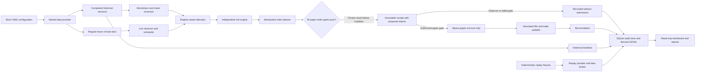

# Adaptive Portfolio Agent

> **PAPER TRADING — SIMULATED CAPITAL AND SIMULATED FILLS**

Adaptive Portfolio Agent is an educational, research-oriented system for historical backtesting, deterministic market replay, live market observation, and long-running Alpaca paper trading of a small US equity and ETF universe. It tests whether a transparent market-regime rule can improve allocation between momentum and mean-reversion strategies while an independent risk engine enforces strict limits.

The distinction is deliberate:

- market information can be real and received as time passes;
- decisions are created and timestamped when the system evaluates them;
- account capital and broker fills are simulated by Alpaca's paper environment; and
- real-money execution is structurally absent.

The project succeeds when it produces a reliable, candid, immutable forward record. The adaptive strategy does not need to outperform. This educational prototype is not investment, financial, legal, tax, or accounting advice, and nothing it produces is a recommendation or solicitation to buy, sell, or hold a security. Historical simulations and forward paper results do not guarantee performance, profitability, capital preservation, or fitness for any purpose. Paper execution can differ materially from real execution, and independently applying these ideas outside the simulated environment can result in loss of principal. Consult appropriately qualified professionals before making financial decisions.

## Permanent safety boundary

- Alpaca trading clients and streams are hard-coded to `paper=True`.
- There is no live broker adapter, live trading base URL, or `paper=False` setting.
- Observer mode is the default and never submits orders.
- Paper submission requires all independent gates: the paper command, `execution.paper_order_submission_enabled: true`, the exact environment token `I_ACKNOWLEDGE_PAPER_ONLY`, verified paper-account credentials, an open regular-hours session, fresh required data, passing risk and reconciliation checks, and no halt or hard-stop latch.
- Only long, unlevered positions in validated US-listed stocks and ETFs are supported. There is no shorting, margin dependence, options, futures, cryptocurrency, extended-hours execution, or high-frequency decision path.
- Strategies propose weights but cannot change risk limits or broker behavior. No LLM or free-form instruction can create an executable trade.

Contributors and development automation must use fakes, replay, observer mode, or `paper-once --dry-run` during development. They must never submit even a paper order while constructing or verifying the repository.

## Market-data disclosure

Forward operational views display the exact IEX banner as a configured-feed
disclosure, with connection and health evidence shown separately. They display
the exact SIP banner only when the current run has persisted SIP entitlement
evidence:

> **REAL-TIME IEX FEED — NOT THE FULL CONSOLIDATED US MARKET**

or:

> **REAL-TIME SIP FEED**

IEX is suitable for this small proof-of-concept universe but is not the complete consolidated US market. SIP may be selected only when the paper credentials are entitled. An entitlement failure is an error; the system does not silently switch feeds. Historical synthetic reports instead identify their actual source as `SYNTHETIC` and show any configured live feed only as configuration context, never as evidence that real-time data was retrieved.

## Architecture



The market-data, broker, clock, and persistence interfaces are dependency-injected. Historical and replay modes use no live network. The live scheduler evaluates at most once per eligible session, using completed prior-session features. Deterministic client order IDs and durable intent records make a restart reconcile before it can retry. See [architecture](docs/architecture.md) and [methodology](docs/methodology.md).

## Requirements and installation

Python 3.11 or newer is required.

```bash
git clone <repository-url>
cd adaptive-portfolio-agent
python3 -m venv .venv
source .venv/bin/activate
python -m pip install --upgrade pip
python -m pip install -e ".[dev,dashboard]"
```

The offline tests, synthetic backtest, and replay do not require Alpaca credentials or internet access.

## Alpaca paper-account setup

1. Create or use an Alpaca paper account. Do not use live-account credentials.
2. Generate paper-account API credentials in Alpaca's paper environment.
3. Copy the example without committing the result:

   ```bash
   cp .env.example .env
   chmod 600 .env
   ```

4. Set only these values in `.env` or export them in the shell:

   ```dotenv
   APA_ALPACA_PAPER_API_KEY=<paper-key>
   APA_ALPACA_PAPER_SECRET_KEY=<paper-secret>
   APA_ENABLE_PAPER_ORDERS=NO
   ```

5. Keep `APA_ENABLE_PAPER_ORDERS=NO` through doctor, observer, and dry-run verification.

Do not source `.env` as shell code. The full-session observer wrapper parses an
existing ignored `.env` with `python-dotenv`, imports only the three approved
names above, and never prints their values. Before any connectivity check, verify
the active environment and disabled submission gate:

```bash
make check-paper-environment
```

When you are ready to collect a full session, invoke
`./scripts/run_full_observer_session.sh configs/observer.yaml`; it performs the
safe dotenv load and repeats the environment check before connectivity. The
wrapper automatically uses `.venv/bin/python` when available. For a
standalone doctor or historical command, inject the same three names through a
trusted local credential manager or a private process environment; never source
an arbitrary dotenv file. The application never reads generic Alpaca credential
variables. Do not paste credentials into YAML, commands, logs, issues,
screenshots, or dashboard fields.

## Configuration

- `configs/observer.yaml` is the dedicated Phase 2 real-market observer configuration. It has its
  own database/output paths and permanently leaves `execution.paper_order_submission_enabled`
  false.
- `configs/paper.yaml` is reserved for a separately approved future simulated-paper phase; it also
  remains disabled in this repository state.
- `configs/backtest.yaml` controls causal historical research and exact static output generation.
- `configs/replay.yaml` controls deterministic minute events, fake broker behavior, disconnects, fills, and restart scenarios.

The default universe is `SPY`, `QQQ`, `IWM`, `EFA`, `EEM`, `TLT`, `GLD`, and `SHY`, benchmarked to `SPY`. Configuration validation normalizes symbols to uppercase, rejects duplicates and unsupported assets or feeds, checks coherent limits and regime allocations, and rejects any attempt to disable paper-only operation or introduce a live trading endpoint. Every run stores its final normalized configuration and hash.

For `market_data.provider: alpaca`, historical refreshes use Alpaca's official `StockHistoricalDataClient` with the configured IEX or entitled SIP feed and corporate-action adjustment, then cache normalized daily opens, closes, volumes, feed, and adjustment locally. The application never falls back to another provider or feed. The supplied backtest configuration deliberately uses deterministic synthetic data so the repository can be verified offline; those results are engineering evidence, not market evidence.

The canonical provider values are only `alpaca`, `synthetic`, and `replay`. A legacy Yahoo normalization/download function remains as a source-compatibility API for the original prototype, is not selectable by canonical configuration, and is not a fallback. Its optional dependency is available only through the `legacy-yahoo` extra; new research runs should use the official Alpaca client or deterministic synthetic data.

## First safe run

Run the read-only diagnostic:

```bash
python -m adaptive_trader.cli doctor --config configs/observer.yaml
```

Doctor validates configuration, local storage, paper credentials when supplied, paper-account identity, asset eligibility, and selected feed entitlement. It performs no order operation. A missing credential is reported honestly rather than fabricated as a successful connection.

Start observer mode:

```bash
python -m adaptive_trader.cli observe --config configs/observer.yaml
# or
make observe
```

Observer mode bootstraps sufficient completed daily history, consumes regular-hours minute bars and paper trade updates, evaluates scheduled decisions, persists hypothetical order intents, reconciles state, and reports why submission is disabled. It never submits, cancels, replaces, or liquidates an order.

Run one dry paper cycle:

```bash
python -m adaptive_trader.cli paper-once --config configs/observer.yaml --dry-run
# or
make paper-dry-run
```

Dry-run follows reconciliation, scheduling, signal, risk, and planning paths but never invokes broker mutation.

## Simulated paper orders are not enabled in Phase 2

This repository currently stops at **REAL-MARKET OBSERVER AND DRY-RUN VALIDATED**. Do not enable
submission or run `paper-run`. A later transition requires a genuine `observer-readiness` PASS,
five completed observer sessions, three real-data dry runs, leadership approval, manual evidence
review, and a new explicit user decision. Until every condition is independently satisfied, the
paper command and optional Compose profile remain prohibited; the retained operational procedure
is documented in the [live paper runbook](docs/live_paper_runbook.md).

## Operational CLI

```bash
python -m adaptive_trader.cli status --config configs/observer.yaml
python -m adaptive_trader.cli reconcile --config configs/observer.yaml
python -m adaptive_trader.cli report --config configs/observer.yaml
python -m adaptive_trader.cli observer-smoke --config configs/observer.yaml --duration-seconds 300
python -m adaptive_trader.cli observer-readiness --config configs/observer.yaml
```

For a safe Phase 2 shutdown, send `SIGINT` or `SIGTERM` once and wait. The
service stops new cycles, records shutdown, stops streams, performs only final
read-only broker checks and reconciliation, and closes the database. Stopping an
observer must cause **zero** broker submissions, cancellations, replacements,
closes, liquidations, or position changes. Do not use paper-operation or liquidation commands
as an observer stop mechanism, and do not use an ungraceful kill unless the
process cannot respond.

## Historical backtesting

```bash
python -m adaptive_trader.cli backtest --config configs/backtest.yaml
python -m adaptive_trader.cli backtest --config configs/backtest.yaml --synthetic
# or
make backtest
```

Signals for session `t` use completed data through `t-1`. The suite compares adaptive allocation, a static 50/50 blend, momentum only, mean reversion only, equal-weight buy-and-hold, and SPY buy-and-hold. Transaction costs and slippage reduce simulated wealth; profitability is never a test condition.

Historical outputs include the exact configuration and data summary; full/post-2020 and regime metrics; daily equity, return, drawdown, weights, allocations, regimes, risk actions, and decisions; immutable receipts; a Markdown report; and separately labeled `historical_*.png` charts. The CLI allocates the application run before simulation, so receipt `run_id` and `decision_id` are identical across SQLite, JSONL, and Markdown. Each completed file bundle is also preserved under the output directory's content-addressed `runs/` archive.

## Deterministic replay

```bash
python -m adaptive_trader.cli replay --config configs/replay.yaml
# or
make replay
```

Replay advances a fake clock through recorded or deterministic events and uses the fake paper broker. It can exercise disconnect recovery, stale data, partial fills, rejections, ambiguous submission, reconciliation, and restart idempotency without network access or credentials.

## Read-only dashboard

```bash
streamlit run app.py
# or, with paper credentials removed from the dashboard environment:
make dashboard
```

Open [http://127.0.0.1:8501](http://127.0.0.1:8501). The dashboard reads persisted state and artifacts. It has no controls or code paths to submit, cancel, replace, or liquidate an order and does not need credentials. It displays system health, simulated paper account and positions, strategy state, paper orders/fills, risk state, historical and forward-paper performance, immutable receipts, feed disclosure, and limitations.

## Database backup

The default SQLite database for this Phase 2 wrapper is
`runtime/primary_real_market_observer.db`. The backup utility uses SQLite's
online backup API and verifies source and destination integrity:

```bash
./scripts/backup_database.sh
# Optional explicit paths:
./scripts/backup_database.sh runtime/primary_real_market_observer.db /secure/path/apa-observer-backup.db
```

Backups are created with owner-only permissions. Store them securely; they
contain account and trading metadata but must never contain credentials. Never
copy a live SQLite file with a raw filesystem copy while it is being written. A
backup satisfies the later readiness gate only after a hash-bound backup
manifest proves that the separate backup passes integrity checks and contains
every accepted observer-session run.

## Docker

Build and start the default observer plus read-only dashboard:

```bash
docker compose build
docker compose up trader dashboard
# or
make docker-observe
```

The image runs as a non-root user, does not contain `.env`, uses Docker-managed persistent volumes for runtime state, outputs, and the data cache, and mounts configuration read-only. The trader command is observer mode. The dashboard receives no credentials and mounts state read-only. Health checks use the persisted service heartbeat/status.

Do not start the optional paper Compose profile or the `docker-paper` target
during Phase 2. This README provides no paper-submission command. Any future
simulated-paper pilot must follow the [live paper runbook](docs/live_paper_runbook.md)
only after genuine readiness, leadership approval, manual review, and a new
explicit user decision.

Docker state lives in named volumes `apa-runtime`, `apa-outputs`, and `apa-data-cache`. Back up the database inside the service and copy the verified backup out when needed:

```bash
docker compose exec trader ./scripts/backup_database.sh
docker compose cp trader:/app/runtime/backups ./runtime/docker-backups
```

## Generated reports

Historical runs generate:

- `metrics_full_period.csv`, `metrics_post_2020.csv`, `annual_returns.csv`, and `regime_metrics.csv`;
- daily values, returns, drawdowns, asset weights, strategy allocations, regimes, risk actions, and rebalance decisions;
- `decision_receipts.jsonl`, `decision_receipts.md`, `run_configuration.yaml`, `data_summary.json`, and `report.md`; and
- `historical_equity_curves.png`, `historical_drawdowns.png`, `historical_regime_timeline.png`, `historical_strategy_allocations.png`, `historical_asset_weights.png`, `historical_rolling_sharpe.png`, and `historical_risk_interventions.png`.

Forward operation generates `forward_paper_summary.csv`, daily performance, positions, orders, fills, risk actions, decision receipts, `forward_report.md`, and clearly labeled forward-paper equity, drawdown, SPY comparison, exposure, strategy allocation, and risk-intervention charts. Its summary reports turnover, decisions, orders, fill/partial-fill/rejection rates, reference-price paper slippage when defined, risk interventions, hard stops, outage episodes, reconciliation discrepancies, and time in each regime. Undefined ratios remain null with an explanation. Paper reports always identify simulated fills and the actual feed.

## Testing and code quality

```bash
ruff format --check .
ruff check .
mypy src
pytest -q
pytest --cov=adaptive_trader --cov-report=term-missing
```

Tests use fake providers, a fake paper broker, fake clocks, temporary databases, deterministic prices, and replay fixtures. They must not connect to Alpaca or any other external service. Safety tests prove paper mode cannot be disabled, observer/dry-run cannot submit, stale or closed-market states block orders, secrets are redacted, latches persist, and restarts do not duplicate orders.

## Troubleshooting

| Symptom | Safe response |
| --- | --- |
| Doctor reports missing credentials | Use offline backtest/replay, or add only paper credentials locally. Do not claim connectivity. |
| Feed entitlement fails | Correct `market_data.feed` or entitlement. Never silently fall back from SIP to IEX. |
| Data is stale or a stream disconnects | Leave submission blocked, inspect health/incidents, wait for backfill and a fresh-bar confirmation. |
| Market is closed | Observer remains useful; wait for regular hours. Do not enable extended hours. |
| Paper run remains dry | Read every failed gate in status/receipt; do not weaken the gate. |
| Unknown order or position mismatch | Halt, reconcile, preserve evidence, and follow the incident guide before resume. |
| Hard stop is latched | Review drawdown, daily loss, account state, and receipts. Resume only with the explicit acknowledgement. |
| Database integrity fails | Halt, preserve the file, restore a verified backup, and reconcile before any resume. |
| Dashboard cannot write | Expected: the operational dashboard is read-only. Generate reports through the CLI. |

See the [live paper runbook](docs/live_paper_runbook.md) and [incident response guide](docs/incident_response.md) for detailed procedures.

## Limitations

- Paper fills are simulated and may be more favorable than real execution.
- Market impact, complete queue dynamics, capacity, taxes, financing, and several failure modes are not represented.
- IEX is not the full consolidated US market.
- A small present-day ETF universe creates selection and survivorship bias.
- Historical execution and costs are simplified: the modeled session-open rebalance only approximates the forward service's 10:05 ET decision. Forward paper results are still not live-money results.
- Regime, volatility, and covariance estimates are backward-looking and can fail during structural changes.
- External paper-account cash flows must be identified; unidentified transfers break return continuity.
- No historical or paper result guarantees future performance.

## Research and governance

Future extensions are outside the initial proof of concept and must not bypass strategy review, risk separation, safety tests, immutable versioning, or the permanent paper-only boundary.

Operational responsibilities, recovery steps, and database/export definitions are documented in [the runbook](docs/live_paper_runbook.md), [incident response](docs/incident_response.md), [data dictionary](docs/data_dictionary.md), [architecture](docs/architecture.md), and [methodology](docs/methodology.md).

Adaptive Portfolio Agent is educational research, not investment advice. The repository cannot trade real capital.
