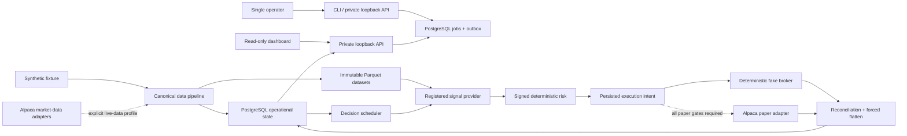

# Autonomous Quant Agent

Autonomous Quant Agent is a self-hosted, single-operator platform for deterministic market-data
processing, strategy proposals, signed risk decisions, and paper-only execution research. The
default profile is credential-free, uses synthetic data and a deterministic fake broker, and has
submission disabled.

This repository does not support real-money trading. It contains no profitability claim, and the
offline demonstration is engineering evidence rather than evidence about a strategy, model, or
market.

## Implementation status

The status labels below distinguish executable evidence from design intent.

### Implemented and offline verified

- strict immutable platform, experiment, universe, session, and risk configuration;
- canonical JSON, deterministic identifiers, UTC and finite-Decimal boundaries;
- canonical one-minute bars, duplicate/correction lineage, exact 15-minute aggregation, gaps,
  watermarks, and immutable dataset manifests;
- PostgreSQL migrations, least-privilege role contracts, transactional repositories, and
  hash-chained audit verification;
- deterministic decision slots and leases, versioned signal envelopes, registered provider
  boundaries, signed risk decisions, durable latches, signed execution planning, reconciliation,
  and forced flattening;
- a deterministic fake broker with restartable scenarios, including ambiguous acceptance;
- bounded jobs/outbox, a private loopback control API, read-only dashboard client, structured
  redaction, and bounded-cardinality metrics;
- the credential-free `aqa demo` vertical slice and local benchmark harness;
- locked quality, security, packaging, and container validation workflows.

The shipped offline demo runs twice in fresh state and requires identical logical evidence. Its
manifest is labeled `OFFLINE_FIXTURE_NOT_ALPACA_EVIDENCE`.

### Implemented but not credential-validated

- Alpaca historical and IEX stream adapters are mock-tested; no real Alpaca key was used to
  validate this platform completion work.
- Paper-only adapter gates are tested with fakes; no Alpaca paper connection or paper order was
  made.
- PostgreSQL and container integration checks require an available local or CI runtime. A check is
  reported as passed only when its command actually completes.

### Intentionally deferred

- new backtester work, feature engineering, model training, XGBoost, model promotion, and a bounded
  strategy-development loop;
- cloud infrastructure, Kubernetes, a public multi-user web product, OAuth credential custody, and
  public raw-market-data distribution;
- native optimization. Python remains the implementation language until repeatable benchmarks and
  profiling identify a concrete bottleneck.

### Unsupported

- real-money trading, live brokerage endpoints, and `paper=False`;
- options, futures, cryptocurrency, foreign exchanges, overnight positions, and early-close entry
  sessions;
- arbitrary URLs, uploaded code, remote strategy source, or strategy access to broker authority;
- public internet deployment or multi-tenant credential storage.

## Architecture



The primary dependency direction is:

```text
market data -> canonical state -> signal proposal -> risk decision
            -> durable intent -> execution policy -> broker adapter -> reconciliation
```

Strategy code is an untrusted proposal producer. It receives an immutable decision context and
cannot submit, cancel, or reconcile orders. Risk and execution do not import strategy internals.
Every broker side effect is preceded by a durable deterministic intent.

See the [cross-system architecture](ARCHITECTURE.md), [legacy application architecture](docs/architecture.md),
[data dictionary](docs/data_dictionary.md), and [decision records](docs/adr/README.md) for the
detailed contracts.

## Trust boundaries

| Process | May hold | Explicitly cannot hold |
| --- | --- | --- |
| market-data worker | scoped database URL; data-only key files in the live-data profile | paper keys, trading client, order authority |
| scheduler | scoped database URL | provider or broker credentials |
| strategy worker | scoped database URL and registered provider code | data/paper keys, broker imports, risk or order writes |
| execution worker | scoped database URL; fake broker offline; paper files only in the paper profile | model/plugin loading, live-money endpoint |
| control API | scoped database URL and operator token | provider keys, broker, direct trade mutation |
| dashboard | API token only | database URL, provider/broker keys, mutation routes |

Secret values are loaded only from owner-private files. Tracked profiles keep submission disabled,
and offline commands do not read Alpaca credentials. Container network separation limits service
reachability but is not claimed to be a complete host-level outbound firewall.

## Five-minute offline quickstart

Requirements: Python 3.11 and [uv](https://docs.astral.sh/uv/). Docker is optional for static
Compose validation.

```bash
git clone https://github.com/yudhiishvs/autonomous-quant-agent.git
cd autonomous-quant-agent
uv sync --locked --all-extras
uv run --no-sync aqa doctor
uv run --no-sync aqa demo
```

The demo writes `outputs/demo/evidence.json`. It uses a temporary SQLite database, deterministic
synthetic bars, and the fake broker. It makes no provider or broker network connection and does not
load credentials. Repeating the command is idempotent when the existing evidence bytes match; use
a different relative `--output` path for a separately retained manifest.

Useful machine-readable checks:

```bash
uv run --no-sync aqa doctor --json
uv run --no-sync aqa data status --json
uv run --no-sync aqa scheduler status --json
uv run --no-sync aqa demo --json --output outputs/demo/evidence.json
```

Validate the container topology without starting services:

```bash
docker compose --env-file .env.example -f docker-compose.yml config --quiet
```

The [demo runbook](docs/demo_runbook.md) explains evidence and safe failure handling.

## Configuration

Tracked profiles live in `configs/platform/`; the default is `offline.yaml`. Each profile pins an
immutable experiment definition and keeps submission disabled. A minimal profile has this shape:

```yaml
schema_version: 1
profile_id: offline
mode: offline
experiment:
  definition_path: experiments/semiconductor_network_intraday_v1.yaml
  expected_definition_hash: c4e66f5a4886215306f3d25c98676ecf48479fac41db9b67848e445c1a46e431
market_data_adapter: deterministic_fixture
signal_provider:
  provider_id: deterministic_fixture
  provider_version: "1"
broker_adapter: fake
execution:
  submission_enabled: false
  paper_only: true
storage:
  database_required: false
```

Run `aqa config validate --config platform/offline.yaml --config-root configs` after any change.
Unknown keys, anchors, unsafe paths, incompatible modes, and hash mismatches fail closed.

Operational profiles use secret-file references documented in the
[developer guide](docs/developer_guide.md). Never commit `.env`, database URLs, key files, provider
payloads, or local data.

## Signal-provider extension

The educational [always-flat provider](examples/always_flat_provider.py) reads only the supplied
`DecisionContext` and returns a non-promotable `SignalEnvelope`. It imports no broker, credential,
network, or database code and is not enabled in tracked paper configuration.

```bash
uv run --no-sync pytest -q tests/unit/test_example_signal_provider.py
```

Installed extensions register objects through the
`autonomous_quant_agent.signal_providers` Python entry-point group. Raw module paths, class names,
commands, URLs, uploaded source, and runtime installation are rejected. Registration never grants
paper authority. See [strategy extension](docs/strategy_extension.md).

## Public CLI

```text
aqa doctor
aqa config validate
aqa secrets bootstrap-local
aqa db migrate
aqa data status
aqa data ingest-fixture
aqa data aggregate
aqa data freeze
aqa scheduler status
aqa shadow run-once
aqa demo
aqa audit verify
aqa api serve
aqa dashboard serve
```

`data ingest-fixture`, `data aggregate`, and `data freeze` are bounded offline verification
commands; they run the complete deterministic fixture slice and publish its immutable evidence.
They are not long-running production workers. `shadow run-once` validates the shadow configuration
without connecting to a provider. Service operation is covered in [operations](docs/operations.md).

The original `adaptive-portfolio-agent`, `adaptive-market-data`, and `adaptive_trader` interfaces
remain compatibility surfaces.

## Verification and test plan

Canonical local gates are:

```bash
uv sync --locked --all-extras
uv run --no-sync ruff format --check .
uv run --no-sync ruff check .
uv run --no-sync mypy src
uv run --no-sync pytest -q
uv run --no-sync pytest --cov=adaptive_trader --cov-branch --cov-report=term-missing
uv run --no-sync python -m adaptive_trader.cli backtest --config configs/backtest.yaml --synthetic
uv run --no-sync python -m adaptive_trader.cli replay --config configs/replay.yaml
docker compose --env-file .env.example -f docker-compose.yml config --quiet
git diff --check
```

The default test suite removes ambient provider authority and denies non-loopback network access.
PostgreSQL tests require an explicitly guarded disposable loopback database named
`collector_test`. The logical restore proof additionally requires PostgreSQL client utilities:

```bash
APA_TEST_POSTGRES_URL='postgresql://…/collector_test' \
APA_TEST_POSTGRES_ALLOW_DESTRUCTIVE=YES \
uv run --no-sync python scripts/postgres_backup_restore_smoke.py
```

Do not point that destructive smoke test at any database containing useful state. See
[backup and restore](docs/backup_restore.md) for its exact safeguards.

Measure local pipeline stages without creating an acceptance threshold:

```bash
uv run --no-sync python scripts/benchmark_pipeline.py --warmups 2 --repeats 5 --iterations 25
```

CI installs from `uv.lock`, runs offline quality and regression gates, exercises PostgreSQL in a
disposable service, scans source/dependencies/containers, builds package artifacts, compares two
offline demo runs, and validates the container configuration. External-provider credentials are
not configured in CI.

## Data licensing and provenance

Synthetic fixtures and their expected hashes may be committed. Raw Alpaca data, reconstructed
provider datasets, account data, and credentials may not be committed or publicly redistributed by
this project. Operators are responsible for their provider agreement, retention rules, exchange
entitlements, and downstream use. Dataset manifests retain provenance and hashes without treating
collection membership as research or execution authority.

The shipped experiment has eight active symbols, one benchmark-only symbol, two context-only
symbols, and eighteen excluded exploratory symbols. Exact identities belong to the versioned YAML,
not the generic platform core.

## Safety model

- Default mode is offline, fake, credential-free, and submission-disabled.
- Shadow mode has no broker adapter.
- Paper submission requires independent profile, acknowledgement, account, credential, signal,
  approval, freshness, reconciliation, and latch gates.
- Unknown broker outcomes become `SUBMISSION_UNKNOWN` and are looked up by deterministic client
  order ID; they are never blindly retried.
- Sign reversal closes and reconciles before a new opposite-side intent can exist.
- Forced flatten reports a durable blocking incident if exact flatness cannot be proved.
- The control API contains no direct order mutation route.

Read [security architecture](docs/security_architecture.md), [threat model](docs/threat_model.md),
[failure modes](docs/failure_modes.md), and [incident response](docs/incident_response.md) before
enabling any external-data profile.

## Compatibility and support

- Python: 3.11 is the supported runtime.
- PostgreSQL: 16 is the operational and integration target.
- OS: Linux is the container/CI target; macOS is supported for local development; native Windows
  is not supported because hardened POSIX file semantics are required.
- Config schema: version 1.
- Signal contract: version 1.
- Releases follow semantic versioning while the public surface is pre-1.0.
- Migrations are forward-only for core market, order, and audit state; destructive downgrades are
  refused.
- A documented public API is deprecated for at least two minor releases when security does not
  require immediate removal.
- Security fixes are applied to the latest released minor version; unsupported releases may need
  to upgrade.

Full policy is in the [developer guide](docs/developer_guide.md).

## Roadmap

The following are separate future projects, not completed capabilities:

1. deterministic after-cost backtester and immutable research datasets at broader scale;
2. feature engineering, model training, bounded model-assisted strategy proposals, and evidence-based
   promotion;
3. temporary cloud/Kubernetes operations after the self-hosted stack is stable;
4. native optimization only after profiling demonstrates a Python bottleneck;
5. a public web UI and multi-user credential model only after the private API and custody design
   receive a separate security review.

## Financial disclaimer

This software is educational and experimental. It is not investment advice, a recommendation,
brokerage service, or promise of returns. Simulated fills and deterministic fixtures do not model
all market, liquidity, borrow, outage, regulatory, or operational risks. No strategy in this
repository has a profitability guarantee. Do not use this software with real money.

## Documentation

Start with the [documentation index](docs/README.md), [developer guide](docs/developer_guide.md),
[operations](docs/operations.md), and [implementation status](docs/implementation_status.md).
Contribution and private vulnerability-reporting procedures are in [CONTRIBUTING.md](CONTRIBUTING.md)
and [SECURITY.md](SECURITY.md).
