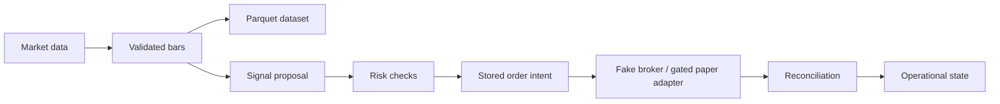

# Autonomous Quant Agent

A Python project for processing market data and testing a paper-trading workflow:
collect bars, build datasets, evaluate a signal, check risk, record an order intent,
and reconcile the result.

The working demo uses synthetic data and a fake broker. It runs without API keys and
produces repeatable evidence. The current work focuses on data integrity, recovery,
and execution safeguards; model training and promotion are deferred. This project
does not support real-money trading.

## Try it locally

Use Python 3.11 and [uv](https://docs.astral.sh/uv/) on macOS or Linux:

```bash
git clone https://github.com/yudhiishvs/autonomous-quant-agent.git
cd autonomous-quant-agent
uv sync --locked --all-extras
uv run --no-sync aqa doctor
uv run --no-sync aqa demo
```

`doctor` checks the offline configuration. `demo` uses a temporary SQLite database,
synthetic bars, and the fake broker, then writes `outputs/demo/evidence.json`.
It makes no provider requests and submits no orders. Repeating it produces the same
logical evidence, labeled `OFFLINE_FIXTURE_NOT_ALPACA_EVIDENCE`; that demonstrates
reproducibility, not investment performance.

To inspect the data pipeline separately:

```bash
uv run --no-sync aqa data ingest-fixture --json
uv run --no-sync aqa data aggregate --json
uv run --no-sync aqa data freeze --json
```

These commands persist 4,290 fixture minute bars, aggregate them, and freeze a
208-row Parquet dataset. See the [demo runbook](docs/demo_runbook.md) for outputs
and troubleshooting.

## How it fits together



PostgreSQL holds operational state; SQLite supports the offline demo and legacy
application. A private API and read-only dashboard expose status. Background workers
handle scheduled work and durable jobs.

Three choices shape the implementation:

- **Store intent before an external action.** A timeout can mean an order was accepted
  even when no response arrived. An ambiguous result is reconciled before retrying.
- **Keep signals separate from execution.** Strategy code proposes a signal; it cannot
  access broker credentials or submit an order. Risk and execution check it independently.
- **Keep source data and derived datasets traceable.** Corrections retain lineage,
  and frozen datasets have immutable manifests so later runs can identify their inputs.

These choices add state and validation code. They also make failures reproducible and
recovery decisions explicit. The [architecture](ARCHITECTURE.md) and
[decision records](docs/adr/README.md) cover the details.

## What works, and what remains

The repository includes market-data normalization and aggregation, dataset publication,
PostgreSQL migrations, durable jobs and outbox delivery, signed risk decisions, paper
execution gates, a private API, and a dashboard. Tests cover duplicate data, corrections,
restarts, lost leases, ambiguous broker outcomes, and rejected inputs.

The container and heartbeat repairs passed CI, security scans, CodeQL, and the offline
demo before the subsequent Git history cleanup. For the latest revision, use the
[Actions results](https://github.com/yudhiishvs/autonomous-quant-agent/actions).
The [implementation status](docs/implementation_status.md) separates completed checks
from outstanding validation.

| Status | Scope |
| --- | --- |
| Implemented and offline verified | Data pipeline, persistence, worker recovery, risk gates, API and demo |
| Implemented but not credential-validated | Alpaca data entitlements and paper account behavior; hosted PostgreSQL/TLS and sustained deployment also remain unvalidated |
| Intentionally deferred | Model training and promotion; model approval remains frozen and tracked profiles disable submission |
| Unsupported | Real-money trading and public multi-user hosting |

Reconciliation also rejects a rounded broker average if it differs from exact fill
evidence. That remains a known integration limitation.

## Development

```bash
uv run --no-sync ruff format --check .
uv run --no-sync ruff check .
uv run --no-sync mypy src
uv run --no-sync pytest -q
```

The ordinary suite needs no provider credentials. PostgreSQL integration tests require
an explicitly disposable database; follow the [testing guide](docs/testing-strategy.md)
before running them. CI also checks package installation, container boundaries,
dependencies, secrets, and combined coverage.

Python 3.11 and PostgreSQL 16 are the supported versions. Containers run on Linux;
macOS is supported for local development. Native Windows is not supported because
some file-security checks depend on POSIX behavior.

## Find your way around

| Area | Start here |
| --- | --- |
| Setup and commands | [Developer guide](docs/developer_guide.md) |
| Service operation | [Operations](docs/operations.md) |
| Data collection | [Collector runbook](docs/market_data_runbook.md) |
| Adding a signal provider | [Extension guide](docs/strategy_extension.md) |
| Engineering fixes | [Development notes](docs/development_notes.md) |
| Security boundaries | [Security model](docs/security-model.md) |
| Contributing | [Contributor guide](CONTRIBUTING.md) |
| All documentation | [Index](docs/README.md) |

Only synthetic fixtures belong in the public repository. Keep credentials, account
records, and downloaded provider data private. This is experimental software and
makes no claim of profitable trading. See [SECURITY.md](SECURITY.md) for vulnerability
reporting and [LICENSE](LICENSE) for licensing.
