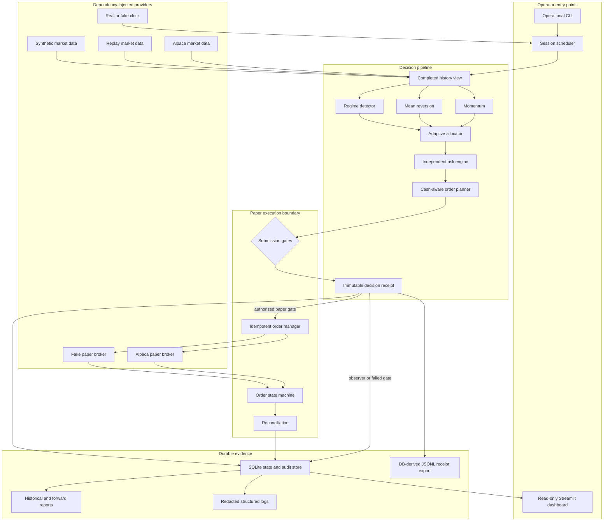

# Architecture

> **PAPER TRADING — SIMULATED CAPITAL AND SIMULATED FILLS**

Adaptive Portfolio Agent has four execution modes—historical backtest, deterministic replay, live observer, and Alpaca paper trading—behind one strategy, risk, persistence, and reporting model. Real-time market information may be real; capital, orders, and fills are always in a simulated paper account. Real-money execution is not implemented.

## Architectural invariants

1. Every Alpaca trading client and trading stream is constructed with `paper=True`; there is no alternate live adapter or endpoint.
2. Observer is the default. Order submission is a separately invoked, multi-gated capability.
3. Strategies propose weights. Only the independent risk engine may approve or reduce risk, and no strategy can modify its limits.
4. Scheduled decisions use completed prior-session daily data and fresh current-session market state. Data after a decision timestamp cannot change that decision.
5. A decision receipt is immutable. Later order, fill, reconciliation, incident, and performance records link to it.
6. A durable intent is written before broker submission. Deterministic client order IDs and reconciliation prevent retry-driven duplicates.
7. Dashboard and reporting code are read-side consumers and cannot mutate broker state.
8. Halt, hard-stop, daily-loss, stale-data, market-closed, and blocking-reconciliation states dominate strategy output.

## Component map

## Responsibilities

| Area | Responsibility |
| --- | --- |
| Configuration | Parse YAML strictly, reject critical unknowns and hazardous live-trading terms, normalize symbols, validate cross-field limits, and create an exact snapshot/hash. Credentials are never configuration fields. |
| Market data | Validate assets, fetch completed daily history, consume the selected minute feed, detect duplicates/out-of-order/stale events, reconnect, backfill gaps, and expose freshness. |
| Strategies | Produce nonnegative momentum and mean-reversion candidate weights plus complete inputs and explanatory metadata. |
| Regime and allocation | Classify one of four transparent regimes and combine strategies with strategic cash without enforcing risk. |
| Risk | Apply latches, session/freshness/eligibility rules, long-only and exposure limits, cash buffer, volatility target, drawdown and daily-loss controls, turnover, order-size, and duplication checks. |
| Planner and order manager | Convert final targets into sell-before-buy intents, respect simulated cash, persist intent before submission, assign stable client IDs, and handle ambiguous outcomes through reconciliation. |
| Persistence | Store normalized state and immutable evidence in SQLite, including configuration, decisions, orders, events, fills, snapshots, health, incidents, reconciliation, and latches. |
| Live service | Coordinate streams, heartbeat, risk monitoring, once-per-session scheduling, graceful shutdown, and restart recovery. |
| Reporting | Export exact historical/forward artifacts and distinguish historical simulation from forward paper performance. |
| Dashboard | Read persisted state and artifacts only. It never imports or invokes broker mutation behavior and receives no credentials. |

## Paper-only broker boundary

`AlpacaPaperBroker` is the only external broker implementation. Construction fixes both `TradingClient(..., paper=True)` and `TradingStream(..., paper=True)`. A broker-mode assertion checks the paper account before any submission-capable service starts. No configuration can change the paper flag, and repository safety tests scan for `paper=False`, prohibited live endpoints, and alternate live broker implementations.

Paper submission is permitted only when all of these are true at the point of use:

1. the operator invoked `paper-once` without `--dry-run` or `paper-run`;
2. configuration explicitly enables paper submission;
3. `APA_ENABLE_PAPER_ORDERS` exactly equals `I_ACKNOWLEDGE_PAPER_ONLY`;
4. paper credentials and account identity are verified;
5. the regular US market session is open and the catch-up cutoff has not passed;
6. required prices and streams are fresh and feed entitlement is confirmed;
7. all risk and cash checks pass;
8. reconciliation has no blocking discrepancy; and
9. neither operator halt nor risk hard-stop is latched.

The result of every gate is included in the receipt. Failure records an observer or dry-run outcome with a reason.

## Live orchestration

At startup the service loads and hashes configuration, migrates/opens the database, restores durable latches/incidents/gaps and once-per-session state, asserts paper mode, verifies the configured feed entitlement, validates every configured asset, and performs a read-only sufficient-completed-history preflight before starting either market or trade-update stream. After connection, the bounded readiness cycle backfills required minute data and exact persisted gap intervals and performs reconciliation before it can produce a target. No submission gate can open merely because the stream threads started.

Continuous tasks update minute bars, account and position snapshots, order events, data freshness, health, incidents, heartbeat, and periodic reconciliation. The scheduler evaluates once at the configured Eastern time. A late restart can catch up only before the configured cutoff and only if no decision receipt already exists for that session.

For an eligible cycle:

1. Freeze a history view ending with the prior completed session.
2. Capture fresh current market/account state and the scheduled and actual timestamps.
3. Generate momentum, mean-reversion, and regime metadata.
4. Combine candidate weights and strategic cash.
5. Pass the proposal through the independent risk engine.
6. Create deterministic hypothetical or executable order intents.
7. Evaluate all paper-order gates.
8. Persist the immutable decision receipt with the proposed intents and gate result before any broker mutation; later execution outcomes are linked immutable events and mutable projections, not receipt rewrites.
9. In observer/dry-run or after a failed gate, stop at the recorded result.
10. In enabled paper mode, submit reductions/sells, consume updates, reconcile, recalculate simulated cash/risk, then submit permitted buys and reconcile again.

SIGINT and SIGTERM stop admission of new cycles, persist shutdown state, stop streams, attempt a final reconciliation, close database resources, and exit. Restart always restores state and reconciles before further submission.

## Order state machine and idempotency

An order moves only through explicitly permitted states, including planned, persisted, submitting, accepted, partially filled, filled, canceled, rejected, expired, and unknown-reconciliation-required. Duplicate trade updates are ignored by their broker event identity and cumulative-fill state. Invalid transitions become incidents rather than being coerced.

The client order ID is a deterministic, length-safe encoding of the run, session/decision, symbol, side, and intent sequence. Before submission, the manager checks the durable local intent, local order record, broker open orders, and broker history. A timeout after a request is ambiguous: the manager never blindly retries; it reconciles by client order ID first.

Sell intents precede buys. After reductions and partial fills, the planner uses reconciled simulated cash rather than margin buying power. No sell can exceed an existing long position, and no order sets extended hours.

## Reconciliation

Reconciliation compares local and paper-broker account identity, clock, open/recent orders, cumulative fills, positions, cash, equity, and configured universe. Findings have informational, warning, blocking, or critical severity.

Unknown broker orders, unexplained position or cash mismatches, unexpected symbols, negative positions, ambiguous submissions, duplicate-client-ID concerns, and critical account-state differences block new paper orders. Clean reconciliation records the exact comparison and may release only the reconciliation block; it never clears an operator halt or hard-stop.

## Persistence and audit design

SQLite is the durable state authority for the proof of concept. Foreign keys and uniqueness constraints enforce one run/configuration relationship, one scheduled decision per session, stable client order IDs, idempotent broker events, and linked execution history. Monetary fields preserve explicit units and timestamps are timezone-aware; UTC instants and Eastern market-session dates are stored separately.

Decision receipt content is immutable after insertion. Corrections and later knowledge are new linked execution, reconciliation, incident, or report records. SQLite is the append-only authority; JSONL and Markdown are read-only, reproducible snapshots of those immutable rows. Re-running the forward report command refreshes the configured derived export directory, so operators should archive semester checkpoints. Historical generation refreshes convenient top-level artifacts and also copies each completed evidence bundle into a content-addressed `runs/<config-hash>-<bundle-hash>/` directory; an existing archive file is never rewritten.

Rotating JSON logs under `runtime/logs` are operational aids, not the audit authority. Log redaction removes credentials and authorization headers. The schema and export contracts are in [data_dictionary.md](data_dictionary.md).

## Historical mode

Historical mode uses completed daily bars and a deterministic event loop. For execution session `t`, all signal, regime, and covariance data end at `t-1`. It applies the same allocator and risk policy to adaptive, static, momentum-only, and mean-reversion portfolios and compares them with equal-weight and SPY buy-and-hold references. Costs and slippage reduce wealth. No broker is constructed.

## Replay mode

Replay replaces the clock, minute data, and broker with deterministic implementations. It exercises the live scheduler and state machine rather than a shortcut around them. Fixtures can inject disconnects, stale bars, partial fills, rejections, timeouts, duplicate updates, broker discrepancies, and process restarts. Given the same configuration and fixture, decisions and outputs are byte-stable except for explicitly excluded runtime metadata.

## Anti-look-ahead design

The central research invariant is:

> A decision scheduled in session `t` may use daily strategy information only through completed session `t-1`.

History slicing occurs before strategy calls, and strategy interfaces receive an explicit as-of timestamp. Rolling windows are trailing and never centered. Backtests perturb data strictly after a cutoff and assert all earlier decisions remain unchanged. Live receipts record historical cutoff, signal-as-of, scheduled evaluation, actual evaluation, current price timestamps, and feed freshness so the boundary can be audited.

## Read-only presentation

The dashboard reads database repositories and generated files. It never constructs a broker, imports the order manager, reads credentials, or renders mutation controls. It permanently shows the paper warning, the configured IEX disclosure when IEX is selected, or the SIP disclosure only when current-run entitlement evidence exists. Historical backtest and forward paper series are labeled separately; undefined metrics remain undefined with an explanation.

## Failure behavior

- A feed disconnect or stale required symbol blocks exposure increases, reconnects with bounded exponential backoff, backfills missing bars, deduplicates, and requires a fresh event before recovery.
- A broker outage blocks submission and records ambiguity rather than retrying blindly.
- Database failure, negative positions, unexpected assets, duplicate-order concerns, or irreconcilable state trigger a persistent halt/block.
- A hard drawdown stop targets cash and latches across restarts. Daily loss blocks new exposure for the session.
- Feed entitlement failure is explicit; there is no IEX/SIP fallback.
- Shutdown, restart, and recovery preserve old decisions and never infer success that was not observed.
