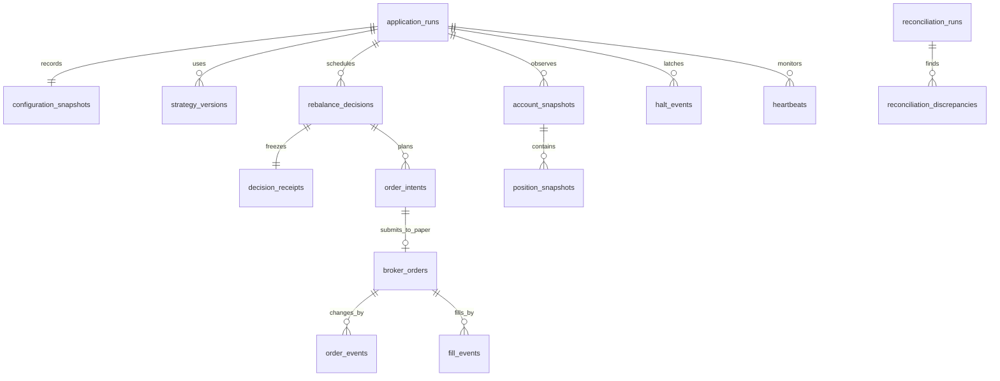

# Data Dictionary

> **PAPER TRADING — SIMULATED CAPITAL AND SIMULATED FILLS**

This document records two implemented physical contracts: the legacy SQLite schema owned by
`src/adaptive_trader/persistence.py`, and the additive generic-platform `aqa` schema owned by
`src/adaptive_trader/platform/storage/`. The export contract remains implemented by `reporting.py`
and `forward_reporting.py`. Names below are physical names, not an aspirational schema. Neither
database stores Alpaca credentials or authorization headers.

## Conventions

- All instants use timezone-aware UTC ISO 8601 values through `UTCDateTime`. `session_date` is the `America/New_York` market-session date (`YYYY-MM-DD`).
- USD money, prices, quantities, notionals, weights, returns, drawdowns, and exposure are serialized as decimal strings in audit tables unless a column below is explicitly `FLOAT` or `INTEGER`. A weight or return of `0.12` means 12%; basis points appear only in configuration fields ending in `_bps`.
- IDs are opaque local identifiers. `broker_order_id` identifies an Alpaca paper object only. `account_id_hash` is a one-way identifier, never a credential.
- JSON columns contain normalized, redacted evidence. A null metric means unavailable/not applicable and its payload or export carries a reason.
- Decision receipts, risk actions, order/fill events, reconciliation findings, stream events, and halt events are append-only facts. Incident identity, message, and details are immutable; only its bounded `resolved_at` projection may be filled later. `broker_orders`, performance rows, and run end fields are bounded projections updated or upserted from those facts.
- Legacy SQLite enables foreign keys, WAL where supported, and a busy timeout.
  `schema_info.schema_version` is checked on every open; an unsupported version is refused.

## Generic platform PostgreSQL schema

Alembic creates the `aqa` schema additively after the predecessor `market_data` schema. Revision
`20260905_0002` creates the 25-table platform inventory, `20260905_0003` upgrades bar revision
history without discarding events, and `20260905_0004` transfers managed ownership, normalizes
privileges, enables audit row policies, and creates security-barrier safe views. Destructive
downgrades of platform state are refused. PostgreSQL 16 is the operational target; isolated tests
may map `aqa` to SQLite, where storage types preserve exact Decimal and UTC validation semantics.

The physical platform inventory is:

| Area | Tables | Current storage behavior |
| --- | --- | --- |
| Experiment and security identity | `aqa_experiments`, `aqa_experiment_symbols`, `aqa_security_metadata_events` | Append-only definitions and observations with explicit content or payload hashes. Repository workflows that populate these tables remain later work. |
| Market data and readiness | `aqa_bar_identities`, `aqa_bar_events`, `aqa_bar_latest`, `aqa_data_gaps`, `aqa_symbol_watermarks`, `aqa_basket_watermarks`, `aqa_dataset_manifests` | The bar revision/latest/symbol-watermark transaction is implemented. Calendar-aware gap lifecycle, basket computation, aggregation, and dataset freezing remain Phase 3 work. |
| Scheduling and decisions | `aqa_decision_slots`, `aqa_signal_envelopes`, `aqa_risk_latch_events`, `aqa_risk_decisions`, `aqa_execution_plans` | Physical constraints exist; the scheduler, signal, and risk repositories and services remain incomplete. |
| Execution and reconciliation | `aqa_order_intents`, `aqa_broker_orders`, `aqa_order_events`, `aqa_fills`, `aqa_reconciliations`, `aqa_incidents` | Physical constraints exist; the generic execution repositories and services remain incomplete. |
| Control and evidence | `aqa_jobs`, `aqa_job_attempts`, `aqa_outbox_events`, `aqa_audit_events` | The append-only audit repository and verifier are implemented. Job/outbox repositories and workers remain incomplete. |

### Canonical bar revisions and symbol watermarks

`aqa_bar_identities` has one row per
`(provider, feed, adjustment, symbol, timeframe, start_at)` interval. `aqa_bar_events` retains every
effective revision: revision 1 inserts, a payload matching the current effective normalized state
is a duplicate without a new row, and changed normalized content appends revision N+1 with
`correction_of_event_id` pointing to the prior event. A later payload may legitimately return to
earlier values; uniqueness is by identity and revision, not by historical payload hash.
`normalized_payload_hash` covers normalized
bar semantics and optional aggregate `lineage_hash`; the separate `content_hash` also covers
immutable receipt and source provenance. `aqa_bar_latest` is a version-fenced projection that must
reference the terminal verified event.

The market-data repository can update `aqa_symbol_watermarks` in the same serialized transaction
as the event and latest projection when its caller presents a quality-approved eligibility claim.
It permits only the next contiguous interval or a correction to the current terminal interval,
binds the watermark to the effective `latest_bar_event_id` and `quality_hash`, and verifies the
stored lineage, timestamps, hashes, and versions when reading. A failed event, projection, or
watermark mutation rolls back the whole transaction. PostgreSQL uses transaction-scoped advisory
locks and version fences; SQLite uses a shared `BEGIN IMMEDIATE` transaction coordinator. The
calendar/gap service that decides eligibility and the active-basket watermark repository are not
yet implemented.

### Audit evidence and read views

`aqa_audit_events` is append-only and unique by `(stream_id, sequence)`. Each event stores a
canonical payload hash and an event hash over stream, sequence, previous hash, event type, actor,
timestamp, and payload hash. The audit repository serializes a stream before deriving its next
sequence, enforces a closed writer-to-stream/event-family contract, treats an identical retry as
idempotent, and independently reconstructs payload, identity, hash, sequence, and previous-hash
continuity during verification. `aqa audit verify` opens storage read-only. Supplying an expected
terminal sequence and hash for one stream also detects deletion of its tail; without an external
expected head, no self-contained append-only database can prove that its terminal rows were not
removed.

PostgreSQL writer reads are scoped through `aqa_collector_audit_events_v`,
`aqa_scheduler_audit_events_v`, `aqa_strategy_audit_events_v`, and
`aqa_execution_audit_events_v`. Row-level insert policies enforce the same actor, stream-prefix,
and event-family boundaries. `aqa_control` and `aqa_readonly` receive the full safe
`aqa_audit_events_v` and the terminal-head projection `aqa_audit_status_v`; ordinary writer roles
do not receive the full audit view.

### PostgreSQL authorization roles

Cluster bootstrap creates seven non-login authorization roles and seven corresponding login
principals. A login inherits exactly its matching authorization role; runtime grants attach to the
non-login role.

| Authorization role | Durable authority |
| --- | --- |
| `aqa_migrate` | Trusted deployment-only owner of the managed schemas, tables, views, and routines. Ordinary business-table DML is self-revoked while migration-version DML and ownership/grant authority are retained. Because ownership can grant privileges again, this role is a trusted deployment boundary, not a runtime sandbox, and no runtime service receives it. |
| `aqa_collector` | Reads experiment/security and market-data state; writes bars, gaps, watermarks, dataset manifests, and actor-scoped audit events. It also retains the explicit predecessor-collector grants needed for a safe `market_data` cutover. |
| `aqa_scheduler` | Reads readiness safe views; inserts/updates decision slots and writes actor-scoped audit events. |
| `aqa_strategy` | Reads decision/data/security safe views; writes signal envelopes and actor-scoped audit events. |
| `aqa_execution` | Reads approved platform state; writes risk, latch, plan, order, fill, reconciliation, incident, and actor-scoped audit state, without DDL authority. |
| `aqa_control` | Reads the full safe-view set; writes bounded jobs/outbox, job attempts, halt latch events, and control-scoped audit events, without order/fill writes. |
| `aqa_readonly` | Selects only explicit security-barrier safe views, including the full audit and audit-status views. It has no table DML or schema authority. |

The bootstrap and migration normalize direct privileges held by both authorization and login roles,
remove unsafe `public` schema/default access, and reject unexpected role attributes or
memberships. Fresh and governed migrations run through `aqa_migrate_login`. A recognized
pre-governance database uses its validated sole legacy owner only through the ownership-transfer
revision, then revokes that temporary membership and reconnects through the migration login.
Service command and Compose adoption of runtime credentials remains later work.

## Legacy SQLite relationships and immutability

`decision_receipts.decision_id` is unique and insertion rejects replacement. Later execution knowledge is written to linked order, fill, reconciliation, incident, performance, or stream records; it does not rewrite the receipt. A `rebalance_decisions` row is a mutable scheduler projection (claimed/completed status) and is not the immutable receipt itself.

## Physical legacy SQLite tables

The database contains exactly the following 28 tables.

### Schema, runs, and versions

| Table | Keys and columns | Meaning |
| --- | --- | --- |
| `schema_info` | PK `key`; `value`, `updated_at` | Schema metadata. Required key `schema_version`; `updated_at` is UTC. |
| `application_runs` | PK `run_id`; `started_at`, `ended_at`, `mode`, `configuration_hash`, `schema_version`, `git_commit`, `python_version`, `dependency_metadata`, `market_data_feed`, `host_identifier`, `shutdown_reason` | One service/replay run. Timestamps are UTC. The host value is hashed; configuration and dependency metadata exclude secrets. |
| `configuration_snapshots` | PK `snapshot_id`; FK `run_id`; unique (`run_id`, `configuration_hash`); `created_at`, `configuration` | Canonical safe configuration and SHA-256 used by the run. Credentials are never part of the canonical object. |
| `strategy_versions` | PK `record_id`; FK `run_id`; unique (`run_id`, `strategy_name`, `version`); `created_at`, `strategy_name`, `version`, `metadata` | Reviewed strategy identity and non-secret metadata. |

Run `mode` values include `historical_backtest`, `observe`, `paper_once`, `paper_run`, `replay`, and degraded/refused diagnostic variants. The historical CLI allocates an application run before simulation and stores the same run/decision identities in SQLite receipts and the JSONL/Markdown artifacts.

### Market data and stream health

| Table | Keys and columns | Meaning |
| --- | --- | --- |
| `market_bars` | PK `bar_id`; unique (`symbol`, `start_at`, `feed`); `end_at`, `open`, `high`, `low`, `close`, `volume`, `trade_count`, `vwap`, `received_at`, `source`, `is_correction`, `revision` | Validated daily/minute OHLCV. Prices/VWAP are positive decimal USD strings; volume/trade count are nonnegative integers; times are UTC. Same-key content changes increment `revision` and mark a correction. |
| `market_data_gaps` | PK `gap_id`; `run_id`, `created_at`, `symbol`, `gap_start`, `gap_end`, `feed`, `resolved_at`, `details` | Detected missing interval and later resolution evidence. An unresolved row has null `resolved_at`. |
| `stream_events` | PK `event_id`; `run_id`, `created_at`, `stream`, `event_type`, `symbol`, `payload` | Append-only connection, disconnection, recovery, out-of-order, shutdown, and monitor events for market/trade/system streams. |
| `heartbeats` | PK `heartbeat_id`; `run_id`, `created_at`, `mode`, `healthy`, `components` | Operational sample. Components include market clock, next open/close, feed, market/trade stream state, freshness, gap state, latches, and monitor timestamps when available. |

`feed` is `IEX`, `SIP`, `REPLAY`, or `SYNTHETIC` as appropriate. Production never silently changes one feed to another. A stale, missing, disconnected, or unresolved-gap state is not “fresh.”

### Simulated paper account snapshots

| Table | Keys and columns | Meaning |
| --- | --- | --- |
| `account_snapshots` | PK `snapshot_id`; `run_id`, `timestamp`, `account_id_hash`, `status`, `equity`, `cash`, `buying_power`, `last_equity`, `trading_blocked`, `source` | Point-in-time simulated Alpaca paper account state. Money fields are USD decimal strings. Buying power is display evidence only; planning uses cash. |
| `position_snapshots` | PK `snapshot_id`; FK `account_snapshot_id`; `run_id`, `timestamp`, `symbol`, `quantity`, `market_value`, `average_entry_price`, `current_price`, `unrealized_pl` | Positions belonging to an account snapshot. Monetary/price fields are USD decimal strings; quantity is a decimal share string. Negative quantity is a critical discrepancy. |

### Strategy and risk facts

| Table | Keys and columns | Meaning |
| --- | --- | --- |
| `strategy_signals` | PK `signal_id`; `run_id`, `decision_id`, `created_at`, `as_of_at`, `payload` | Versioned momentum and mean-reversion inputs, selections, scores, volatilities, weights, cutoff, warnings, or rejection. |
| `regime_states` | PK `regime_state_id`; same common columns | Benchmark MA/volatility evidence and one of `bull_low_vol`, `bull_high_vol`, `bear_low_vol`, `bear_high_vol`. |
| `allocation_results` | PK `allocation_id`; same common columns | Regime budgets, pre-risk target/cash, and operational final target. |
| `risk_decisions` | PK `risk_decision_id`; same common columns | Proposed/final weights, estimated volatility/turnover, engine actions, operational latch actions, and final cash target. |
| `risk_actions` | PK `risk_action_id`; `run_id`, `decision_id`, `created_at`, `control`, `description`, `details` | Deduplicated append-only interventions. ID is deterministic from decision and action content. Weights/limits in `details` are fractions. |

The four decision-fact tables share UTC `created_at`/`as_of_at` and immutable JSON payloads. Strategies can propose values but cannot change configuration risk limits or submission gates.

### Decisions and immutable receipts

| Table | Keys and columns | Meaning |
| --- | --- | --- |
| `rebalance_decisions` | PK `decision_id`; unique `idempotency_key`; `run_id`, `session_date`, `strategy_version`, `mode`, `scheduled_at`, `created_at`, `completed_at`, `status`, `skip_reason`, `payload` | Durable once-per-run/strategy/session claim and current lifecycle projection. Typical statuses: `claimed`, `observed`, `rejected`, `missed_after_cutoff`, `submitted`, `execution_pending`, `submission_unknown`, `no_orders`, and `duplicate` (returned without creating another row). |
| `decision_receipts` | PK `receipt_id`; unique `decision_id`; `run_id`, `created_at`, `receipt_hash`, `payload` | Immutable complete receipt. SHA-256 detects content changes. |

Receipt payload keys include `decision_id`, `run_id`, `session_date`, `configuration_hash`, `strategy_version`, `scheduled_at`, `actual_at`, `mode`, market/feed/freshness state, account and positions, signal cutoff, momentum, mean reversion, regime, allocation, proposed/final targets and cash, drawdown/daily loss, turnover/volatility, risk actions, gate result, hypothetical/executable intents, reconciliation, submitted IDs, final-known execution status, warnings, incidents, and skip reason. Unavailable fields remain null with a reason; they are not fabricated as zero.

### Paper order execution

| Table | Keys and columns | Meaning |
| --- | --- | --- |
| `order_intents` | PK `intent_id`; unique `client_order_id`; unique (`decision_id`, `symbol`, `side`); `run_id`, `session_date`, `sequence`, `notional`, `quantity`, `reference_price`, `reason`, `created_at` | Deterministic plan. `side` is `buy`/`sell`; sequence orders sells before buys. Notional/price are USD decimal strings; quantity is shares. Observer/dry-run rows use a `hypothetical_<mode>:` reason and have no broker-order row. |
| `broker_orders` | PK `client_order_id`; unique nullable `broker_order_id`; `run_id`, `decision_id`, `symbol`, `side`, `state`, `raw_status`, `requested_notional`, `requested_quantity`, `filled_quantity`, `average_fill_price`, `submission_started_at`, `submitted_at`, `last_update_at`, `error_code`, `error_message` | Current local projection of an Alpaca paper order. Monetary/quantity values are decimal strings and errors are redacted. |
| `order_events` | PK `order_event_id`; unique `event_key`; `client_order_id`, `broker_order_id`, `decision_id`, `created_at`, `from_state`, `to_state`, `event_type`, `payload` | Append-only idempotent order transition/evidence. A duplicate broker update reuses its fingerprint and is ignored. |
| `fill_events` | PK `fill_id`; `client_order_id`, `broker_order_id`, `decision_id`, `created_at`, `symbol`, `side`, `quantity`, `price`, `payload` | Append-only simulated Alpaca partial/final fill. Quantity is shares; price is USD; `fill_id`/execution identity prevents double counting. |

Local order states are `planned`, `locally_reserved`, `submission_started`, `submitted`, `accepted`, `pending`, `partially_filled`, `cancel_requested`, `canceled`, `filled`, `rejected`, `expired`, `replaced`, and `submission_unknown`. Terminal states are filled/canceled/rejected/expired/replaced. Invalid or contradictory transitions raise and create evidence rather than silently rewriting history. A timeout after submission becomes `submission_unknown` and requires reconciliation; it is never blindly retried.

All external submissions are market, `DAY`, regular-hours, long-only Alpaca paper orders with `extended_hours=False`. No live-money order table or adapter exists.

### Reconciliation, latches, and incidents

| Table | Keys and columns | Meaning |
| --- | --- | --- |
| `reconciliation_runs` | PK `reconciliation_id`; `run_id`, `started_at`, `completed_at`, `clean`, `blocking`, `summary` | Broker/local comparison attempt and aggregate result. |
| `reconciliation_discrepancies` | PK `discrepancy_id`; FK `reconciliation_id`; `created_at`, `kind`, `severity`, `symbol`, `client_order_id`, `message`, `details`, `resolved_at` | Append-only finding such as unknown order, position mismatch, unexpected symbol, negative position, cash/equity mismatch, or fill mismatch. |
| `halt_events` | PK `halt_event_id`; `run_id`, `created_at`, `action`, `latch_type`, `initiator`, `reason`, `acknowledgement`, `session_date`, `details` | Append-only latch state transitions. Active state is derived by replaying events; old events are never erased. |
| `system_incidents` | PK `incident_id`; `run_id`, `created_at`, `incident_type`, `severity`, `message`, `details`, `resolved_at` | Redacted operational incident and optional linked resolution time. |

Discrepancy/incident severities are `informational`, `warning`, `blocking`, or `critical` as applicable. Halt actions include `halt`, `hard_stop`, `daily_loss`, `resume`, and `expired`; latch types include `operator`, `manual`, `hard_stop`, and `daily_loss`. A daily-loss latch expires only during the next valid market session after a clean, nonblocking reconciliation whose ID and timestamp are stored with the expiry. Operator/manual/hard-stop resume requires the exact acknowledgement plus a new clean reconciliation and fresh connected data.

### Forward performance and reports

| Table | Keys and columns | Meaning |
| --- | --- | --- |
| `daily_performance` | PK `performance_id`; unique (`run_id`, `session_date`); `created_at`, nullable `value`, `payload` | Idempotent forward paper session projection. Payload includes segment, equity, external flow, P&L/return, drawdown, exposure, cash, turnover, continuity and undefined reason. |
| `benchmark_performance` | PK `benchmark_id`; unique (`run_id`, `session_date`); same generic columns | Aligned benchmark observation/return or a truthful availability reason. |
| `generated_reports` | PK `report_id`; `run_id`, `created_at`, `report_type`, `path`, `content_hash`, `metadata` | Idempotence/evidence for post-close or operator report generation, including failed attempts. |

`daily_performance.payload` fields are: `session_date`, `segment_id`, `start_equity`, `end_equity`, `external_cash_flow`, `daily_pnl`, nullable `daily_return`, `cumulative_return`, `drawdown`, `gross_exposure`, `cash_allocation`, nullable `turnover`, nullable `regime`, `continuity_flag`, and `return_unavailable_reason`, plus aligned benchmark fields. Equity/P&L/flow are USD; returns/exposure/drawdown/cash are fractions. An external deposit/withdrawal of unknown intrainterval timing sets that interval return to null, starts a new segment, and is never counted as strategy P&L.

## Historical artifact schemas

All CSV files are UTF-8 with headers and deterministic row ordering.

| File | Columns/content |
| --- | --- |
| `metrics_full_period.csv`, `metrics_out_of_sample.csv`, `metrics_development.csv`, `metrics_validation.csv`, `metrics_holdout.csv` | `portfolio`; `total_return`, `cagr`, `annualized_volatility`, `sharpe_ratio`, `sortino_ratio`, `maximum_drawdown`, `calmar_ratio`, `var_95`, `cvar_95`, `positive_day_percentage`, `average_gross_exposure`, `average_cash_allocation`, `total_turnover`, `estimated_transaction_costs`, `number_of_rebalances`, `number_of_risk_interventions`, `number_of_hard_stop_events`; and one `<metric>_reason` column per metric. The development/validation/holdout files are emitted when all frozen-window fields are configured. |
| `annual_returns.csv` | `year`, `portfolio`, `annual_return`, `observations`. |
| `regime_metrics.csv` | `portfolio`, `regime`, `observations`, the same metric and reason columns as above. |
| `daily_portfolio_values.csv` | `date`, `portfolio`, `equity` (USD normalized to configured starting capital). |
| `daily_returns.csv` | `date`, `portfolio`, `daily_return` (fraction). |
| `daily_drawdowns.csv` | `date`, `portfolio`, `drawdown` (fraction). |
| `asset_weights.csv` | `date`, `portfolio`, `asset`, `weight`; `cash` is an asset column melted to a row. |
| `strategy_allocations.csv` | `date`, `portfolio`, `momentum`, `mean_reversion`, `strategic_cash` (fractions). |
| `regimes.csv` | `date`, `portfolio`, `regime`. |
| `risk_actions.csv` | `portfolio`, `signal_as_of_date`, `execution_date`, `control`, `description`, `details`, plus any normalized additional fields. |
| `rebalance_decisions.csv` | Normalized receipt/rebalance fields led by `portfolio`, `signal_as_of_date`, `as_of_date`, `execution_date`; nested fields use dotted column names. |
| `decision_receipts.jsonl` | One canonical complete historical receipt per line, including every scheduled skip/rejection. |
| `decision_receipts.md` | Human-readable JSON block for every receipt, not a selected sample. |
| `run_configuration.yaml` | Canonical safe configuration; no credentials. |
| `data_summary.json` | Source/feed/adjustment, synthetic and open-price flags, configuration hash, benchmark/universe, date range, observation/missing counts, and disclosure. |
| `report.md` | Historical-only methodology/results, metric reasons, plots, limitations, synthetic/source and paper disclaimers. |

Historical plots are `historical_equity_curves.png`, `historical_drawdowns.png`, `historical_regime_timeline.png`, `historical_strategy_allocations.png`, `historical_asset_weights.png`, `historical_rolling_sharpe.png`, and `historical_risk_interventions.png`.

The configured historical output directory contains latest-run convenience files plus an immutable content-addressed copy under `runs/<configuration-hash-prefix>-<bundle-hash>/`. Generation verifies rather than overwrites any existing archive file.

## Forward paper artifact schemas

| File | Canonical columns/content |
| --- | --- |
| `forward_paper_summary.csv` | One row: paper/feed disclosure; equity, cash, return, drawdown, benchmark return and turnover; decision/order/fill/rejection/risk/hard-stop/outage/discrepancy counts; fill, partial-fill and rejection rates; reference-linked average adverse paper slippage; time fraction in each regime; and explicit undefined-reason fields. |
| `forward_daily_performance.csv` | `session_date`, `segment_id`, `start_equity`, `end_equity`, `external_cash_flow`, `daily_return`, `cumulative_return`, `daily_pnl`, `drawdown`, `gross_exposure`, `cash_allocation`, `turnover`, `continuity_status`, `undefined_reason`; production payload fields may add evidence columns. |
| `forward_positions.csv` | `timestamp`, `symbol`, `quantity`, `market_value`, `average_entry_price`, `current_price`, `unrealized_pl`, plus snapshot/run linkage when present. |
| `forward_orders.csv` | `client_order_id`, `broker_order_id`, `decision_id`, `symbol`, `side`, `state`, `filled_quantity`, `average_fill_price`, `last_update_at`, plus request/timing/error projection columns when present. |
| `forward_fills.csv` | `fill_id`, `client_order_id`, `broker_order_id`, `decision_id`, `created_at`, `symbol`, `side`, `quantity`, `price`, plus redacted payload evidence. |
| `forward_risk_actions.csv` | `risk_action_id`, `decision_id`, `created_at`, `control`, `description`, plus run/details evidence. |
| `forward_decision_receipts.jsonl` | One immutable database receipt per line, flattened safely for export. |
| `forward_report.md` | Permanent paper/feed disclosure, current available metrics, every receipt, discontinuity warning, reconciliation/risk counts, limitations, and no-advice language. |

Forward plots are `forward_paper_equity.png`, `forward_paper_drawdown.png`, `forward_paper_vs_benchmark.png`, `forward_exposure.png`, `forward_strategy_allocations.png`, and `forward_risk_interventions.png`. Empty databases produce labeled placeholders rather than invented observations. SIP-labeled dashboards and reports require a `feed_entitlement_confirmed` stream event for the latest application run whose payload names SIP; stale evidence from an older run is rejected, and the system never falls back to IEX.

Daily and benchmark tables are physically unique per application run and session. Reporting treats `payload.series_id` as the logical forward-series identity and keeps the latest projection per `(series_id, session_date)`, so an ordinary daemon restart does not duplicate a session or turnover in exports.
