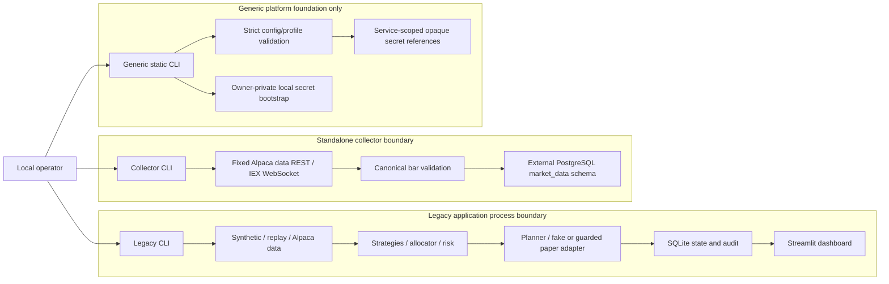
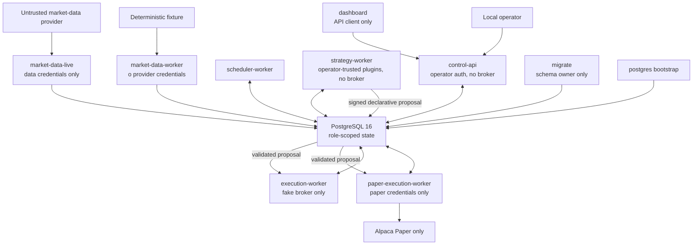

# Security Architecture

## Purpose and status

This document defines the security boundaries for the current repository and the target generic
platform. It complements the operational threat discussion in [security-model.md](security-model.md),
the system map in [ARCHITECTURE.md](../ARCHITECTURE.md), and the normative requirement ledger in
[requirements.md](requirements.md).

The distinction between current and target state is mandatory:

- The legacy research/paper-simulation application and standalone market-data collector are
  executable today.
- The generic platform currently implements canonical serialization, hashing, immutable
  experiment/profile composition, service-scoped runtime-setting composition, hardened POSIX
  secret-file loading, and local infrastructure-secret bootstrap.
- The generic platform services, PostgreSQL role model, signed signal/risk/execution path, private
  API, API-backed dashboard, audit chain, and target Compose topology are `NOT_IMPLEMENTED` unless
  a narrower current control is explicitly identified below.
- Alpaca-backed collector and legacy paper paths are
  `IMPLEMENTED_NOT_EXTERNALLY_VALIDATED`. Ordinary tests and CI do not contact Alpaca.
- Real-money execution is `INTENTIONALLY_DEFERRED` and prohibited by the supported product
  boundary.

Documentation is not an authorization control. A target design in this file must not be treated as
an implemented capability.

## Governing principle

Every component is untrusted until explicitly authorized, every external input is validated,
every privilege is minimized, every consequential action is auditable, and every ambiguous state
fails closed.

The practical consequence is that data collection does not confer execution authority, a strategy
proposal does not confer order authority, and an operator-facing HTTP process does not receive a
broker client merely because it can request bounded control-state changes.

## Critical invariants

These are normative target invariants. The current implementation enforces only the subsets named
in the capability and evidence matrices below; in particular, end-to-end redaction across every
service surface is still `PARTIALLY_IMPLEMENTED`.

1. No supported path creates a real-money order or constructs a non-paper trading client.
2. Ordinary tests, CI, and the default offline mode use no Alpaca credentials and make no Alpaca
   connection.
3. Collection membership is not research, strategy, risk, or execution authorization.
4. Only the active experiment's exact tradable-symbol set can reach order planning; benchmark,
   context, excluded, unknown, and aliased symbols cannot.
5. Strategy output is untrusted declarative data and cannot bypass independent validation, risk,
   planning, persistence, and reconciliation.
6. The execution/reconciliation process is the only target service permitted to receive paper
   credentials. It receives no data-provider credentials, plugin discovery, model loader, DDL
   authority, or generic trading hostname.
7. A durable order intent precedes every submission attempt. Ambiguous submission blocks new
   exposure and is resolved by deterministic client-order-ID lookup and reconciliation, never by a
   blind retry.
8. Missing, stale, malformed, nonfinite, mismatched, or internally inconsistent authorization
   input produces no new exposure.
9. Target services prevent secrets, database URLs, authorization headers, raw request/response
   objects, and credential-bearing exceptions from entering logs, metrics, API responses,
   artifacts, or audit payloads. Current verification covers the generic secret wrapper/settings
   boundary and a subset of legacy logging surfaces, not the complete target path.
10. Every target service receives only its explicit configuration, secret mounts, database role,
    network reachability, and persistent-state authority.
11. Consequential state is append-only or changed through validated state transitions; failures do
    not erase the evidence needed for replay, reconciliation, or incident analysis.
12. Tracked profiles keep paper submission disabled. An acknowledgement by itself is never
    sufficient authority to submit.

## Current topology



The three paths do not yet form one production service graph. The legacy dashboard reads SQLite
directly. The collector owns a separate PostgreSQL schema and has no downstream platform consumer.
The generic platform CLI does not start a database, API, collector, scheduler, strategy, risk, or
execution service and no runtime command consumes a loaded platform secret.

### Current capability matrix

| Current component | May access or modify | Prohibited or absent | Status |
| --- | --- | --- | --- |
| Standalone collector | Collector data credentials, fixed Alpaca data hosts, configured PostgreSQL, validated bars, runs, leases, checkpoints, and collector events | Paper credentials, trading SDK/client, order state, legacy execution, arbitrary URL, DDL during runtime | `IMPLEMENTED_AND_VERIFIED` with fakes and PostgreSQL integration; external provider operation is `IMPLEMENTED_NOT_EXTERNALLY_VALIDATED` |
| Legacy strategy/allocation | Completed history and legacy configuration | Direct credential access, direct broker mutation, ownership of risk policy | `IMPLEMENTED_AND_VERIFIED` within the legacy path |
| Legacy execution/paper adapter | Legacy paper credential object after explicit gates; SQLite order/fill/reconciliation state | Real-money client, configurable trading host, unsupported symbols, silent retry of ambiguous submission | `IMPLEMENTED_NOT_EXTERNALLY_VALIDATED` for Alpaca paper operation |
| Current Streamlit dashboard | Direct read access to legacy SQLite and report artifacts | Application-level order mutation; target API isolation and least-privilege launch are absent | `PARTIALLY_IMPLEMENTED` relative to the target |
| Generic config/runtime composition | Explicitly injected environment mapping, strict profiles, immutable experiment identity, closed service/secret scope, opaque references | Ambient environment reads, secret-file reads during composition, network/client construction, persistent mutation | `IMPLEMENTED_AND_VERIFIED` |
| Generic secret loader | One explicitly referenced current-user-owned POSIX regular file in mode `0400` or `0600`, up to 16 KiB | Symlinks, directories/special files, shared modes, NUL, empty or invalid UTF-8 content, serialization of values | `IMPLEMENTED_AND_VERIFIED` |
| Local secret bootstrap | Exact fixed local infrastructure inventory beneath an owner-controlled application root | Alpaca keys, arbitrary filenames, overwrite, value output, unsafe existing state | `IMPLEMENTED_AND_VERIFIED` |
| Current CI | Locked Python 3.11 install, offline checks, configuration for digest-pinned disposable PostgreSQL 16 with a runtime major-version assertion, Compose validation, image builds, and collector image network denial | Local container-runtime validation is unavailable; exact remote-run evidence belongs in the active execution plan; Alpaca credentials/calls and the remaining target security/SBOM/container-scan/CodeQL job set are absent | `PARTIALLY_IMPLEMENTED` relative to the target |

The standalone collector still uses the legacy `APA_*` runtime namespace. The generic platform
secret interface below is a new boundary and does not retroactively make the legacy processes
service-isolated.

## Target topology

The target is a self-hosted, single-operator, paper-only topology. PostgreSQL transactions,
durable jobs, and a transactional outbox are used instead of a separate message broker.



Required decision direction:

```text
external data -> canonical events -> durable readiness -> decision slot
-> untrusted signed signal -> independent signed risk decision
-> persisted order intent -> selected fake/paper adapter
-> broker events/fills -> reconciliation -> audit
```

The default Compose invocation is entirely offline. `market-data-live` exists only under the
`market-data` profile and `paper-execution-worker` only under the `paper` profile; neither starts
by default. Tracked paper configuration keeps submission disabled and the default authorization
verifier denies with `model_approval_not_implemented`.

### Target process capability matrix

All rows in this table are `NOT_IMPLEMENTED` as deployed process isolation unless stated
otherwise. Current pure `RuntimeSettings` scope validation models the listed secret references for
the nine non-PostgreSQL process identities, but service commands and mounts do not yet enforce it.

| Target component | Allowed capabilities | Explicitly forbidden capabilities |
| --- | --- | --- |
| `postgres` | Initialize private PostgreSQL state from database bootstrap secrets | Public network exposure, broker/data credentials, application execution |
| `migrate` | Apply versioned schema and grants with migration database URL | Long-running application work, broker/data credentials, order submission |
| `control-api` | Read safe views; create bounded jobs/outbox records; write audited halt/resume events | Provider or paper credentials, broker adapters, raw market-data download, strategy/plugin installation, secret return, order submit/cancel/replace/flatten routes, arbitrary path/URL/code/SQL/shell |
| `market-data-worker` | Read experiment metadata; write fixture bars, gaps, watermarks, datasets, and audit state | Alpaca credentials in offline mode, paper credentials, trading client, order/risk tables, risk-latch clearing, model/plugin installation, arbitrary URL, shell execution |
| `scheduler-worker` | Read calendars/readiness; claim and transition durable slots; write audit state | Any Alpaca credential, provider/broker adapter, strategy internals, arbitrary network access, order submission |
| `strategy-worker` | Read immutable decision/data views; load locally registered signal providers; write signed signals and audit state | Broker/paper credentials, DDL, risk mutation, API-selected imports, order mutation |
| `execution-worker` | Read approved signals/data/security metadata; run independent risk; write latches, intents, fake orders/fills, reconciliation, incidents, and audit | Alpaca credentials, plugin/model/research-code loading, database-superuser access, DDL, arbitrary network, real-money mode |
| `dashboard` | Call authenticated private API and render bounded safe read models | Database driver/role, filesystem secrets other than its API token file, Alpaca credentials, order/control widgets |
| `market-data-live` | Fixed Alpaca data REST/WebSocket; collector database role; validated experiment collection allowlist | Paper credentials, trading SDK/client, order/risk authority, arbitrary host, feed fallback |
| `paper-execution-worker` | Approved signed decisions, independent risk, execution/reconciliation database role, literal paper adapter, paper credentials and account hash | Data credentials, model/plugin loading, DDL, configurable trading host, `paper=False`, real-money mode |

Locally installed strategy providers are operator-trusted Python code. They are not sandboxed, but
the platform interface and process launch must still withhold broker objects, credentials, DDL,
and execution imports. Arbitrary untrusted Python sandboxing is `INTENTIONALLY_DEFERRED`.

## Secret architecture

### Exact generic-platform secret-file interface

The generic platform accepts only these seven secret-file variables:

```text
AQA_DATABASE_URL_FILE
AQA_OPERATOR_TOKEN_FILE
AQA_ALPACA_DATA_API_KEY_FILE
AQA_ALPACA_DATA_SECRET_KEY_FILE
AQA_ALPACA_PAPER_API_KEY_FILE
AQA_ALPACA_PAPER_SECRET_KEY_FILE
AQA_PAPER_ACCOUNT_ID_HASH_FILE
```

Secret values must not be accepted directly through environment variables.

### Rejected generic credential variables

The generic platform rejects the presence of exactly these generic SDK variables:

```text
APCA_API_KEY_ID
APCA_API_SECRET_KEY
APCA_API_BASE_URL
ALPACA_API_KEY
ALPACA_SECRET_KEY
```

There is no configurable Alpaca trading hostname; the future adapter must construct the SDK with
literal `paper=True`.

### Exact non-secret runtime interface

The only generic-platform non-secret environment variables and their defaults are:

```text
AQA_CONFIG=configs/platform/offline.yaml
AQA_ARTIFACT_ROOT=outputs/artifacts
AQA_API_BASE_URL=http://127.0.0.1:8000
AQA_LOG_FORMAT=json
AQA_ENABLE_PAPER_ORDERS=NO
AQA_API_DOCS_ENABLED=NO
```

The implemented secret loader descriptor-walks a bounded canonical POSIX path without following
symlinks, requires a regular file owned by the current effective user in mode `0400` or `0600`,
reads no more than 16 KiB, rejects NUL/empty/invalid UTF-8 content, removes exactly one terminal LF,
and exposes the result through a nonserializable wrapper whose `str` and `repr` are `<redacted>`.
Its ordinary errors identify the allowlisted variable and a stable reason but not the secret value
or path. Secret use still requires an explicit future adapter-boundary call to `reveal()`.

### Exact local bootstrap output

`aqa secrets bootstrap-local` creates or preserves exactly these nine files under the ignored
owner-only `secrets/` directory:

```text
postgres_password
aqa_migrate_password
aqa_collector_password
aqa_scheduler_password
aqa_strategy_password
aqa_execution_password
aqa_control_password
aqa_readonly_password
operator_token
```

The bootstrap uses cryptographic randomness, creates the directory as `0700` and files as `0600`,
never overwrites an existing valid file, serializes concurrent threads/processes with local and
advisory locks, and prints only relative filenames. It neither requests nor creates Alpaca keys.
It is POSIX-only and relies on current-user ownership plus effective advisory locking on the host
filesystem.

### Target secret mount and database-role matrix

This matrix is normative target state and is `NOT_IMPLEMENTED` in current Compose. Each database
URL file contains a role-specific URL even though every process refers to it through the same
`AQA_DATABASE_URL_FILE` variable.

| Service | Target secret mounts | Target PostgreSQL authority |
| --- | --- | --- |
| `postgres` | Database bootstrap password files only | Server bootstrap; not an application role |
| `migrate` | `AQA_DATABASE_URL_FILE` containing the `aqa_migrate` URL | Schema migration and grants only |
| `control-api` | `AQA_DATABASE_URL_FILE` containing the `aqa_control` URL; `AQA_OPERATOR_TOKEN_FILE` | Safe views; bounded jobs/outbox/halt/resume; no order/fill writes |
| `market-data-worker` | Offline `AQA_DATABASE_URL_FILE` for `aqa_collector` when PostgreSQL is selected; no Alpaca file | Read experiment/security metadata; write bars/gaps/watermarks/datasets/audit |
| `scheduler-worker` | `AQA_DATABASE_URL_FILE` containing the `aqa_scheduler` URL | Read readiness; write slots/audit |
| `strategy-worker` | `AQA_DATABASE_URL_FILE` containing the `aqa_strategy` URL | Read decision/data views; write signals/audit |
| `execution-worker` | `AQA_DATABASE_URL_FILE` containing the `aqa_execution` URL | Read approved signal/data/security state; write risk/latches/execution/orders/fills/reconciliation/incidents/audit; no DDL |
| `dashboard` | `AQA_OPERATOR_TOKEN_FILE` only | No database role or direct database network |
| `market-data-live` | `AQA_DATABASE_URL_FILE` for `aqa_collector`; `AQA_ALPACA_DATA_API_KEY_FILE`; `AQA_ALPACA_DATA_SECRET_KEY_FILE` | Same collector role; no execution state authority |
| `paper-execution-worker` | `AQA_DATABASE_URL_FILE` for `aqa_execution`; `AQA_ALPACA_PAPER_API_KEY_FILE`; `AQA_ALPACA_PAPER_SECRET_KEY_FILE`; `AQA_PAPER_ACCOUNT_ID_HASH_FILE` | Same execution role; no DDL |

`aqa_readonly` is a database role with `SELECT` only on explicit safe views. It is not assigned to
the dashboard, which must use the API. No service receives one shared credential bundle.

## Authentication and authorization

### Current controls

The current supported deployment is single-operator and has no generic HTTP control plane. Host
login, filesystem permissions, CLI access, and database credentials form the current operator
boundary. The legacy paper path requires explicit command selection, tracked configuration
enablement, an exact acknowledgement, verified paper account/credentials, current session and
fresh state, independent risk approval, and clean reconciliation. Tracked configuration disables
submission.

### Target controls

The private FastAPI control plane binds `127.0.0.1:8000` by default, uses a bearer token loaded from
`AQA_OPERATOR_TOKEN_FILE`, requires at least 32 bytes, and compares tokens with
`hmac.compare_digest`. Cookies and CORS are disabled; interactive docs default off. Authenticated
responses use `Cache-Control: no-store` and `X-Content-Type-Options: nosniff`, with a restrictive
content security policy where applicable. Read routes are limited to 120 requests/minute per token
and mutation routes to 10; this is loop protection, not distributed denial-of-service protection.

Only liveness/readiness are unauthenticated. Authenticated mutations are restricted to four
bounded job types and audited halt/resume events. No API route directly submits, cancels, replaces,
liquidates, or flattens an order.

These API controls are `NOT_IMPLEMENTED`.

### Unresolved operator-token/dashboard conflict

The exact interface defines one `AQA_OPERATOR_TOKEN_FILE`, while the target dashboard receives an
API token and must have server-enforced read-only authority. If the dashboard and human operator
share the same bearer token and authorization is token-only, compromise of the dashboard also
grants the bounded mutation routes. A read-only dashboard client does not solve that authorization
problem.

Therefore the API-backed dashboard, its mount, and `REQ-ARCH-007`/`REQ-UI-001` authorization claims
remain `NOT_IMPLEMENTED` until a design within the exact secret contract can distinguish dashboard
read authority from operator mutation authority. No implementation may silently mount the full
operator mutation token into the dashboard and call the result least privilege.

## Input and code-execution controls

### Implemented boundaries

- Experiment and profile YAML use strict schemas, bounded no-symlink paths, no anchors/aliases,
  exact enum values, unknown-field rejection, and immutable models. Composed platform-profile
  loading requires the profile to pin the selected experiment hash; the lower-level standalone
  experiment loader accepts an optional expected hash for compatibility.
- Runtime settings read only an explicitly supplied mapping; reject unknown `AQA_*` names and
  generic Alpaca variables; validate service/mode combinations; and create no client, file, or
  network connection.
- Collector provider hosts are constants. Provider payloads undergo bounded decoding, exact symbol
  allowlisting, temporal/OHLCV validation, and canonical identity/hash construction before durable
  projection.
- SQL in the collector repository is parameterized and connection-routing override keys are
  rejected.
- Architecture tests constrain imports around generic configuration, collector trading authority,
  and prohibited platform capabilities.

### Target boundaries

- API and job schemas accept no arbitrary URL, filesystem path, raw SQL, shell command, environment
  variable, module/class/function path, Python source, broker credential, raw market-data transfer,
  strategy installation, or experiment replacement.
- Artifact APIs accept only IDs matching `^[a-z0-9][a-z0-9._-]{0,127}$`; storage rejects traversal,
  absolute/NUL paths, symlink components, root escape, and conflicting immutable overwrite.
- Platform runtime does not use `pickle`, `joblib`, `dill`, `cloudpickle`, `marshal`, untrusted
  `eval`/`exec`/`compile`, payload-driven subprocesses, or arbitrary dynamic imports.
- Parquet, JSON, and YAML artifacts receive size, schema, path, and content-hash validation. No
  upload endpoint exists.

The generic API, job, artifact, plugin-discovery, and signed-envelope input boundaries in this
target list are `NOT_IMPLEMENTED`.

## Network controls

### Current controls

- The standalone collector uses fixed official Alpaca data hosts, rejects proxy inheritance and
  endpoint overrides, and has no trading SDK import.
- Non-loopback collector PostgreSQL connections require `sslmode=verify-full`; loopback may be
  plaintext for local development/tests.
- Current CI supplies empty Alpaca variables. Its collector container smoke test runs with
  `--network none`, while the offline pytest guard blocks common Python TCP connection paths and
  permits explicitly marked loopback PostgreSQL integration.
- Current Compose does not provision PostgreSQL, has no target internal-network separation, and
  publishes the dashboard on all host interfaces. It is not the target topology.

### Target controls

- Only `127.0.0.1:8000:8000` and `127.0.0.1:8501:8501` are published by default. PostgreSQL is not
  published except under an explicit `db-debug` profile bound to loopback.
- Internal networks limit dashboard-to-API, API-to-database, and worker-to-database reachability.
  PostgreSQL has no public route.
- Default services have no provider dependency. Live data and paper execution require distinct,
  explicitly selected profiles and disjoint credentials.
- Ordinary tests, CI, and the offline demo deny external sockets while permitting only required
  loopback/Unix integration.

Compose segmentation is not a general outbound firewall. Process-wide socket denial and the target
network topology are `NOT_IMPLEMENTED`; operators remain responsible for host/cloud egress policy.

## Persistence and integrity controls

### Current controls

- Collector PostgreSQL writes use transactions, parameter binding, constraints, selected immutable
  triggers, stable identities, monotonic checkpoints, singleton leases, and fencing tokens.
  Observation/projection persistence precedes checkpoint advancement, so a crash causes safe replay
  rather than optimistic readiness.
- Legacy SQLite persists decision identity, intent/order/fill transitions, incidents, latches, and
  reconciliation facts. Intent-first persistence and deterministic client IDs limit duplicate
  broker effects.
- Secret values are neither configuration-model fields nor PostgreSQL data. Local bootstrap values
  remain ignored owner-private files.

### Target controls

- PostgreSQL 16 owns operational state. Separate roles enforce schema, collector, scheduler,
  strategy, execution, control, and safe-view read authority.
- Canonical bar corrections remain append-only; watermarks represent the highest contiguous
  quality-approved interval rather than latest receipt.
- Experiment, dataset, signal, risk, plan, order, fill, reconciliation, job, and artifact identities
  are immutable and content-addressed where specified.
- Every consequential stream is append-only and hash chained; `aqa audit verify` checks sequence,
  previous hash, and event hash.
- Durable jobs and outbox events are created atomically. Claims use leases and PostgreSQL
  `FOR UPDATE SKIP LOCKED`; payloads route work but never grant authorization.
- Logical backup/restore must be tested into a fresh database and reverify versions, row counts,
  hashes, audit chains, slots, intents, fills, and reconciliation state.

The target role/grant schema, platform tables, audit chain, jobs/outbox, artifact store, and tested
backup/restore procedure are `NOT_IMPLEMENTED`.

## Failure, restart, and side-effect containment

- Current collector retries only classified transient provider failures with bounded backoff,
  records run/events, persists before advancing coverage, and uses leases/fencing to reject stale
  writers. Explicit gap production and contiguous active-basket readiness are `NOT_IMPLEMENTED`.
- Current legacy execution persists intent before submission, treats post-submit uncertainty as
  ambiguous, and requires reconciliation instead of automatic resubmission.
- The target scheduler uses durable slots, transactional claims, 30-second leases, fixed deadlines,
  and no catch-up trading after a missed deadline. Materialized decisions are never recomputed.
- Target order state includes `SUBMISSION_UNKNOWN` and `RECONCILIATION_REQUIRED`; either blocks new
  exposure. Reversal closes and proves flat before an opposite opening leg is considered.
- Blocking or critical reconciliation discrepancies engage an append-only latch. Session-loss and
  deployment-drawdown latches survive restart and require authenticated, explicitly acknowledged
  clearing.
- Forced flatten must create a blocking incident when flat state cannot be proved by the deadline;
  it must not report success from an unverified broker state.
- Target workers restart from authoritative durable state, replay idempotently, and prefer a
  durable safe failure over an inferred transition.

The target slot/signal/risk/execution/job/reconciliation/flatten implementation is
`NOT_IMPLEMENTED`. Operational response must follow
[incident_response.md](incident_response.md) without deleting or rewriting adverse evidence.

## Logging, audit, metrics, and evidence

Current legacy logging applies structural/value redaction and the collector records bounded event
facts, but the target centralized observability layer is `PARTIALLY_IMPLEMENTED` at most.

The target requires:

- structured JSON with bounded identifiers, state transitions, and stable reason codes;
- central structural redaction for keys containing `secret`, `password`, `token`, `authorization`,
  `credential`, `api_key`, `private_key`, `cookie`, `connection_string`, or `database_url`;
- append-only per-stream audit chaining with no secret-bearing payload;
- bounded-cardinality Prometheus labels that exclude free text, arbitrary identifiers, exception
  text, symbols supplied by users, and secrets;
- safe test/demo evidence containing engineering outcomes, never credentials or profitability
  claims.

No raw headers, environment/settings dumps, complete provider/broker messages, database URLs,
tokens, or raw sensitive exceptions may be logged. The target audit verifier and Prometheus
inventory are `NOT_IMPLEMENTED`.

## Container and CI controls

### Current controls

- GitHub Actions uses read-only repository permission, pinned action commits, checkout without
  persisted credentials, Python 3.11, `uv.lock`, Ruff, mypy, the full offline tests, synthetic
  backtest, deterministic replay, Compose validation, locked image builds, and empty Alpaca
  variables with paper enablement set to `NO`.
- The collector image uses a nonroot user and omits the Alpaca trading SDK and application
  execution modules. The current Compose collector service additionally applies a read-only root
  filesystem, dropped capabilities, and no-new-privileges.
- The current workflow is configured to verify a digest-pinned PostgreSQL 16 service and its runtime
  major version, with exact remote-run evidence recorded per commit in the active execution plan;
  it still combines checks into one offline job.

### Target controls

- One locked multi-stage image is reused across service commands, runs as a numeric nonroot user,
  carries no compiler/toolchain or secret in runtime layers, supports a read-only root, and exposes
  only explicit writable runtime/artifact mounts and `/tmp`.
- Every service drops all capabilities, sets `no-new-privileges`, uses `tmpfs` for `/tmp`, receives
  service-specific volumes/secrets, has health checks and bounded restart, and uses resource limits
  where supported.
- CI adds PostgreSQL 16 migration/role/concurrency tests, secret/dependency/static scans, twice-run
  socket-denied demo evidence, container SBOM/vulnerability scanning, and Python CodeQL with least
  permissions. Pull requests do not push images or publish/sign releases.
- Pre-commit pins formatting/linting, syntax, private-key/secret, and large-file checks without
  turning every commit into a full integration run.

The target container/Compose service set and the additional security, demo, container/SBOM, and
CodeQL jobs are `NOT_IMPLEMENTED`. Base-image digests and action commits must never be invented;
they are added only after resolution from authoritative sources.

## Control and evidence matrix

| Control | Current evidence | Status / limitation |
| --- | --- | --- |
| Closed seven-variable platform secret namespace | `tests/unit/test_platform_security.py::test_secret_file_variable_inventory_is_exact`; runtime inventory tests | `IMPLEMENTED_AND_VERIFIED` for the generic foundation |
| Owner-private, no-symlink, redacted secret loading | Positive, mode, ownership, file-type, symlink, race, size/content, serialization, and safe-error cases in `tests/unit/test_platform_security.py` | `IMPLEMENTED_AND_VERIFIED` on supported POSIX semantics; no service consumes it yet |
| Fixed nine-file local bootstrap | Inventory, rerun, mode, hostile-umask, collision, partial-write, concurrency, output, and ambient-credential tests in `tests/unit/test_platform_secret_bootstrap.py` | `IMPLEMENTED_AND_VERIFIED`; no Alpaca keys generated |
| Immutable experiment/profile identity and default-deny profile composition | `tests/unit/test_platform_experiment.py`, `test_platform_profiles.py`, `test_platform_runtime_settings.py`, and static CLI tests | `IMPLEMENTED_AND_VERIFIED`; later services do not consume it |
| Service-scoped secret-reference selection | Exact service/profile/scope, omission, serialization, ambient-environment, and no-secret-load tests in `tests/unit/test_platform_runtime_settings.py` | `IMPLEMENTED_AND_VERIFIED` as pure composition; mounts/process launch are `NOT_IMPLEMENTED` |
| Collector cannot gain trading authority | `tests/architecture/` import/source boundaries, collector credential tests, and collector-only image smoke test | `IMPLEMENTED_AND_VERIFIED` for current module/image boundary; host process sandbox is limited |
| No ordinary test/CI Alpaca access | Empty CI variables, paper `NO`, pytest TCP guards, deterministic fakes, and collector container `--network none` smoke | `PARTIALLY_IMPLEMENTED`: common TCP paths are guarded, process-wide denial is absent |
| Submission disabled and paper-only | Tracked configuration, static endpoint/client scans, and legacy safety matrix | `IMPLEMENTED_AND_VERIFIED` as default/gate behavior; credential-based paper operation is not externally validated |
| Intent-first and ambiguity containment | Legacy execution/reconciliation unit, integration, and replay tests | `IMPLEMENTED_AND_VERIFIED` for legacy semantics; target signed execution is `NOT_IMPLEMENTED` |
| Collector transactional/fencing integrity | Collector repository/service tests and disposable PostgreSQL migration/integration tests | `IMPLEMENTED_AND_VERIFIED` for current schema; target PostgreSQL 16 role matrix is absent |
| API authentication, authorization, size/rate limits, and no trade routes | Requirement and design review only | `NOT_IMPLEMENTED` |
| Read-only dashboard enforced by server authority | No supporting implementation; exact token conflict remains | `NOT_IMPLEMENTED` |
| Target role grants and unauthorized-write denial | Requirement and design review only | `NOT_IMPLEMENTED` |
| Hash-chained audit and bounded metrics | Requirement and design review only | `NOT_IMPLEMENTED` |
| Complete target CI security/supply-chain gates | Baseline quality job only | `PARTIALLY_IMPLEMENTED` |

Tests prove only the behavior they execute. External credentials, hosted databases, broker
responses, host firewall policy, backup restoration, and container-runtime enforcement require
separate recorded validation before their controls can be described as externally validated.

## Residual risks and unresolved decisions

- Credential-based Alpaca data and paper behavior has not been validated in this implementation
  program. No current test evidence proves provider entitlements, provider-side key scope, or
  broker behavior.
- The current legacy application can place market-data and paper capabilities in one process. The
  generic service-scoped secret interface does not repair that legacy authority boundary.
- No generic service command consumes `RuntimeSettings` or the hardened loader. Least-privilege
  mounts, process identities, database grants, and target networks are not currently enforced.
- The single named operator token cannot simultaneously be a full operator mutation credential and
  a server-enforced read-only dashboard credential. This must be resolved before the target API and
  dashboard are accepted.
- The current dashboard reads SQLite directly, can inherit unrelated parent environment variables,
  and publishes its Compose port beyond loopback. Application code does not intentionally consume
  broker secrets, but launch-time isolation is incomplete.
- Local bootstrap depends on macOS/Linux descriptor-relative filesystem operations and advisory
  `flock`. Host compromise, ineffective locking on an unusual filesystem, and backup copies of
  local secrets remain outside the primitive's control.
- Compose network separation will reduce reachability but is not an outbound firewall. Host/cloud
  egress restrictions remain an operator responsibility.
- Installed strategy plugins are operator-trusted code and are not sandboxed. A compromised plugin
  process must be contained by credentials, imports, database grants, networks, and the independent
  risk/execution boundary, none of which is fully deployed yet.
- A database owner, host administrator, compromised dependency, or compromised container may bypass
  application checks. Detection, least privilege, immutable evidence, restoration, and dependency
  scanning reduce but do not eliminate this risk.
- The stored collector-universe row is not yet reverified against the in-process contract at
  startup and lacks an immutability trigger.
- Explicit collector gap lifecycle, contiguous active-basket readiness, security metadata,
  artifact integrity, retention, audit chaining, backup/restore proof, and target incident recovery
  remain `NOT_IMPLEMENTED`.
- Current socket guards do not prove process-wide network denial. Current CI lacks the target
  PostgreSQL 16 role tests, secret/dependency/container scans, SBOM, offline-demo evidence comparison,
  and CodeQL jobs.
- Real-money support and public multi-user hosting remain outside the supported security model.

## Change discipline

Any change that alters credentials, process authority, database grants, network reachability,
public routes, persistence semantics, submission gates, failure recovery, audit evidence, or
container/CI enforcement must update this document, [security-model.md](security-model.md), the
corresponding requirement status, and behavioral tests in the same natural change. A control moves
to `IMPLEMENTED_AND_VERIFIED` only after its stated test or procedure has actually run.
